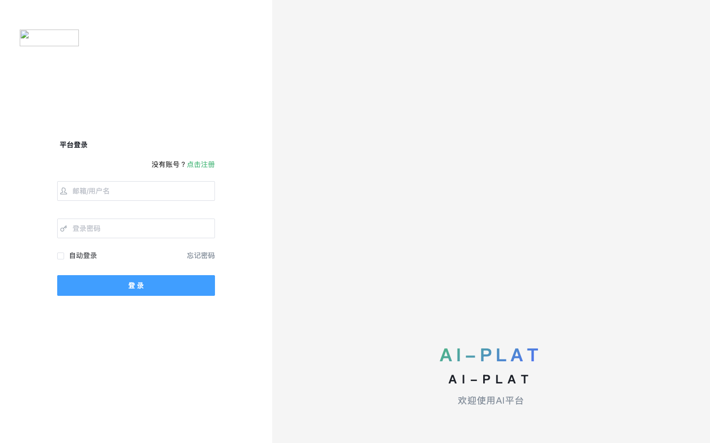
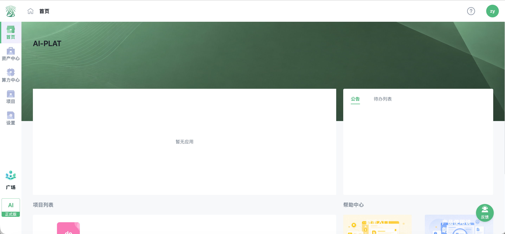
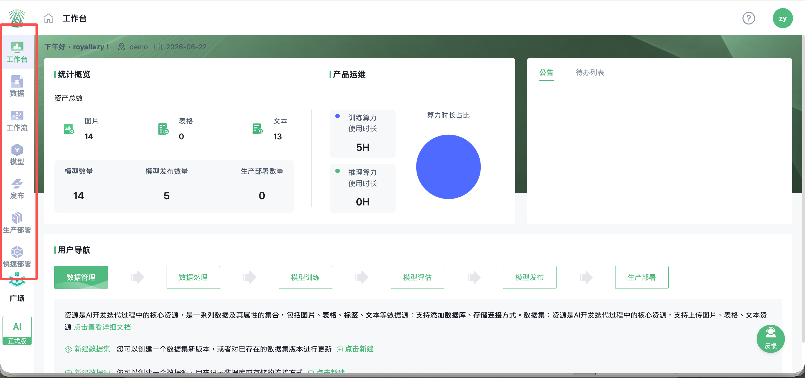
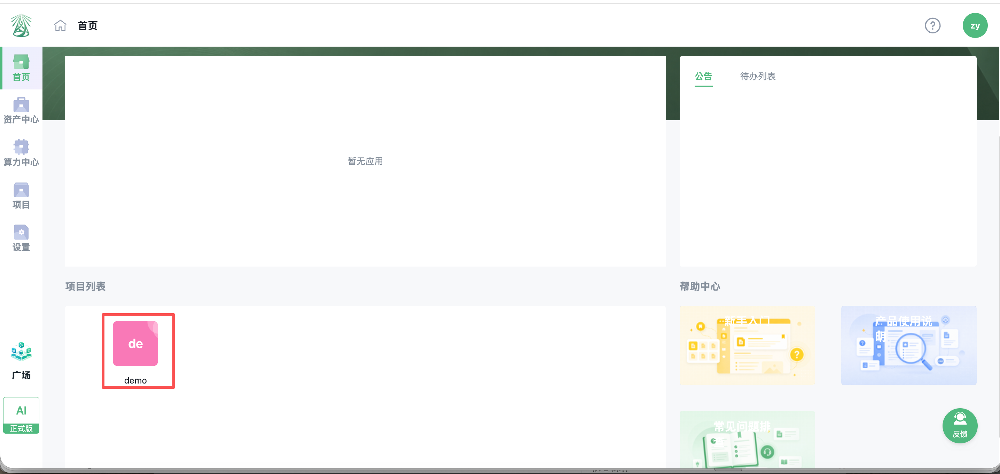
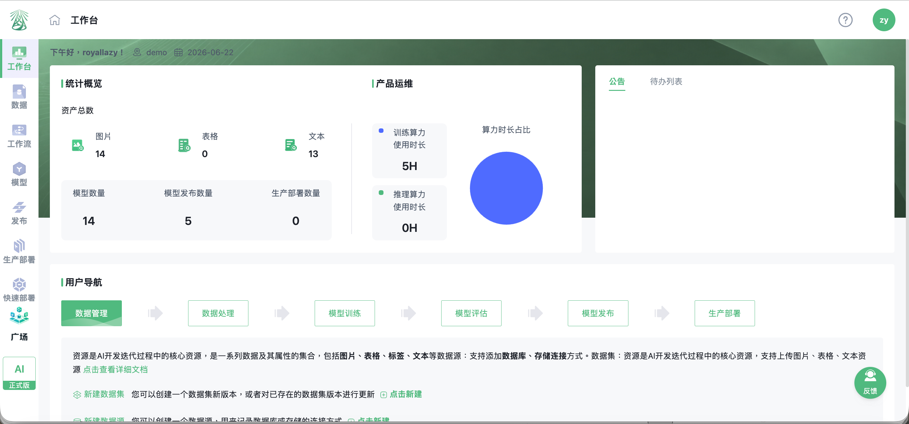

# AI-PLAT用户手册

## 第一部分：试用准备与平台入门

本册是 AI-PLAT 客户试用手册的第一部分，适合首次接触平台的客户阅读。通过本册，读者可以了解平台定位、适用对象、试用前准备、账号登录配置以及项目入口。

阅读衔接：本册完成后，建议继续阅读《AI-PLAT客户试用使用文档（二）：核心功能操作指南》，进入数据、组件、工作流、模型和部署等实际操作。

---

## 1. 文档说明

### 1.1 文档目标

本文档用于指导客户快速熟悉 AI-PLAT 平台，并通过一条完整的试用流程，完成从账号注册、登录、项目创建、资源上传、组件获取、工作流运行到模型发布和部署验证的基础操作。

客户可以按照本文档顺序完成一次完整的平台试用，也可以根据自身角色直接进入对应章节操作。

### 1.2 平台简介

AI-PLAT 是面向企业 AI 开发和维护的低代码平台，帮助企业自主开发和维护 AI，实现设备故障预测分析、工艺参数优化、缺陷检测识别等 AI 场景。

平台可以用于两类典型场景：

- **AI 模型维护**：当企业已有 AI 模型投入使用后，若场景变化或模型精度偏移，可通过 AI-PLAT 自主维护模型，使模型重新适配业务现场。
- **AI 应用开发**：当企业需要建设新的 AI 应用时，可通过 AI-PLAT 完成数据准备、标注、训练、评估、部署等完整流程。

### 1.3 核心功能模块

| 功能模块 | 说明 |
| --- | --- |
| 算力设备管理 | 算力设备接入、分配、用量统计 |
| 资源管理 | 资源注册、数据存储、版本管理 |
| 数据清洗处理 | 标签标注、标签审核、数据预处理 |
| 模型生产 | 行业算法库、模型训练、模型评估、优化加速 |
| 部署管理 | 模型发布、快速部署、生产部署 |
| 系统功能 | 账号系统、角色权限管理、消息通知 |
| 市集 | 公共产品库、算法组件库、资产广场 |

### 1.4 适用场景

- 新客户试用 AI-PLAT
- 客户交付培训
- 客户成功团队远程指导
- 客户内部二次培训
- 售后支持与常见问题解答

---

## 2. 适用对象

### 2.1 企业管理员

企业管理员主要负责项目创建、成员管理、权限配置、算力设备分配、资源审批、发布审批等管理工作。

### 2.2 AI 生产工程师

AI 生产工程师主要负责数据上传、标签标注、组件拉取、工作流创建、模型训练、模型预测和模型评估。

### 2.3 AI 运维工程师

AI 运维工程师主要负责模型发布、快速部署、API 部署、生产部署、部署监控、日志排查和服务更新回退。

### 2.4 普通业务用户

普通业务用户主要参与试用验证、数据准备、标注任务执行、模型 Demo 测试和试用反馈。

---

## 3. 试用前准备

### 3.1 账号准备

| 信息 | 填写 |
| --- | --- |
| 平台访问地址 |  |
| 登录邮箱或用户名 |  |
| 初始密码 |  |
| 所属组织/团队 |  |
| 所属项目 |  |
| 账号角色 |  |
| 客户成功经理 |  |

### 3.2 浏览器与网络环境

请使用 Edge 浏览器或 64 位 Google Chrome 浏览器访问 AI-PLAT，并确认网络可以正常访问平台地址。

### 3.3 数据准备

| 数据类型 | 用途 | 常见格式 |
| --- | --- | --- |
| 图片 | 标注、图像处理、训练、预测、评估 | `.jpg`、`.jpeg`、`.png`、`.bmp` |
| 标签 | 训练和评估时与图片对应 | 目标检测/分类常用 `.xml`，图像分割支持 `.xml` 或 `.json` |
| 表格 | 结构化数据处理 | `.csv`、`.xlsx`、`.xls` |
| 文本 | 文本类数据或配置文件 | `.txt`、`.yml`、`.yaml`、`.pdf`、`.html` |
| 模型 | 上传或部署已有模型 | `.pkl`、`.pth`、`.pb`、`.ckpt`、`.onnx`、`.trt` |

### 3.4 试用权限准备

试用前请确认已拥有可登录账号、已加入目标项目、项目内已分配可用算力设备，并具备资源、组件、工作流、模型、部署等模块权限。如需创建项目，请确认账号具备超级管理员或相应管理权限。

---

## 4. 平台登录与账号配置

### 4.1 注册 AI-PLAT 账号

功能用途：用于客户首次获得 AI-PLAT 登录账号。

操作步骤：

1. 使用 Edge 或 64 位 Chrome 浏览器访问平台地址。
2. 进入登录页面后，点击右上角【点击注册】。
3. 在注册页面输入真实邮箱地址、用户名、手机号、密码，并二次确认密码。
4. 点击【立即注册】。
5. 打开注册邮箱，查收来自 AI-PLAT 的验证邮件。
6. 点击邮件中的验证链接，完成注册。

注意事项：

- 密码长度为 8-18 位字符，且必须包含字母和数字。
- 如未收到验证邮件，请先检查垃圾箱。
- 如仍未收到，请等待 60 秒后点击【重新发送】。

预期结果：注册成功后，用户可以使用注册邮箱登录 AI-PLAT。

### 4.2 登录 AI-PLAT

操作步骤：

1. 打开 AI-PLAT 登录页面。
2. 输入注册邮箱或用户名。
3. 输入密码。
4. 点击【登录】。

登录页面示例：

注意事项：首次使用 AI-PLAT 的新用户，建议使用注册邮箱登录。修改用户名后，也可以使用用户名登录。登录页面支持隐藏/显示密码。勾选【自动登录】后，10 天内可默认登录。

### 4.3 修改用户名

操作步骤：登录 AI-PLAT 后点击右上角个人图标 ->【设置】->【基本信息】-> 点击用户名输入框或用户名修改按钮 -> 修改用户名后点击【确定】或保存。

注意事项：用户名长度为 2-36 字节。修改用户名后，可以使用用户名和密码登录。

### 4.4 找回密码

操作步骤：

1. 在 AI-PLAT 登录页面右下角点击【忘记密码】。
2. 输入已注册的邮箱账号。
3. 点击【确认】。
4. 打开注册邮箱，查收找回密码邮件。
5. 点击邮件中的验证链接，进入重置密码页面。
6. 输入新密码并再次确认。
7. 点击【确认】，完成密码重置。

注意事项：密码长度为 8-18 位字符，且必须包含字母和数字。如未收到邮件，请检查垃圾箱或等待 60 秒后重新发送。

---

## 5. 平台首页与项目介绍

### 5.1 主页面布局

| 区域 | 说明 |
| --- | --- |
| 左侧按钮栏 | 包含首页、资产中心、算力中心、项目、设置、广场等入口 |
| 上方菜单栏 | 包含搜索、通知、个人中心等入口 |
| 主页操作区 | 展示当前模块的列表、详情、配置和操作内容 |

点击左侧按钮栏后，主页操作区会切换为对应模块，菜单栏页面路径会随当前模块同步更新。通知和待办可用于查看审批、标注任务、运行状态等信息。

平台主界面示例：

### 5.2 项目概念

AI-PLAT 中的项目可以理解为一个工作空间，是进行资源管理、标签任务、工作流创建、模型训练、模型验证和部署管理的主要空间。

项目内常见功能包括：工作台、数据、工作流、模型、发布、快速部署、生产部署、设置。

项目常见功能入口示例：

### 5.3 如何加入项目

如果您还未加入项目，请联系项目管理员或超级管理员创建项目，并在项目中添加您的账号、分配对应角色和权限。如果您已加入项目，点击左侧【项目】，在项目列表中点击项目卡片即可进入项目内部。

项目入口示例：

进入项目后的工作台示例：

---

## 下一步阅读

完成本册后，客户应已具备登录平台、识别首页入口、进入项目空间的基础能力。下一册《AI-PLAT客户试用使用文档（二）：核心功能操作指南》将从项目创建和成员管理开始，继续说明组件获取、资源上传、标注任务、工作流运行、模型训练评估和部署验证等核心操作。
