# AI-PLAT 用户手册

## 第二部分 · 02 数据与模型资源管理

本章说明如何将业务数据和已有模型纳入项目，并完成版本、预览、下载等资源管理操作。

---

### 2.1 数据集概览与创建方式

功能用途：用于将图片、表格、文本等数据上传为平台数据集，供后续标注、处理、训练、预测使用。

操作入口：项目内【数据管理】->【新建】，或项目内【数据】->【数据集列表】->【新建】。

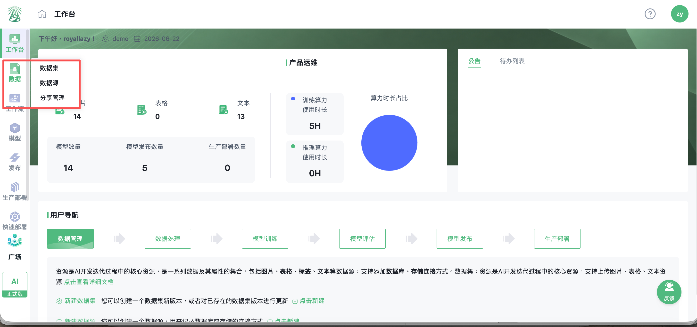

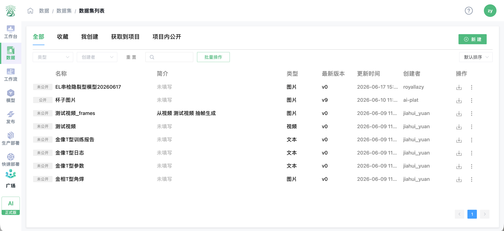

数据集列表用于集中查看项目内已有的数据资源。每一行代表一个数据集，常见字段说明如下：

| 字段 | 说明 |
| --- | --- |
| 公开状态 | 标识当前数据集是否已公开，例如公开或未公开 |
| 名称 | 数据集名称，用于识别具体数据资源 |
| 简介 | 数据集的简要说明，未填写时页面会显示未填写 |
| 类型 | 数据集资源类型，例如图片、视频、文本、表格等 |
| 最新版本 | 当前数据集最新版本号，例如 v0、v9 |
| 更新时间 | 数据集最近一次更新的时间 |
| 创建者 | 创建或上传该数据集的账号 |
| 操作 | 支持下载、更多操作等管理入口 |

### 2.2 创建图片数据集

在数据集列表页右上角点击【新建】，进入数据集创建流程。

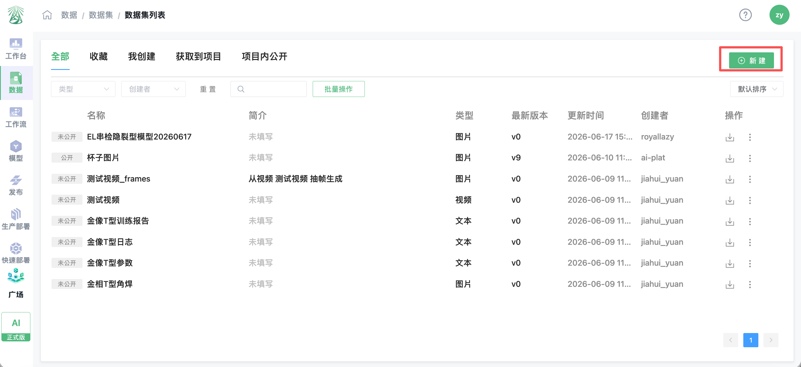

进入新建页面后，需要先选择新建方式：

| 新建方式 | 说明 |
| --- | --- |
| 新建数据集 | 创建一个全新的数据集，适用于首次上传新的图片、表格或文本资源 |
| 新建数据集新版本 | 基于已有数据集追加一个新版本，适用于同一数据集后续补充、更新或迭代 |

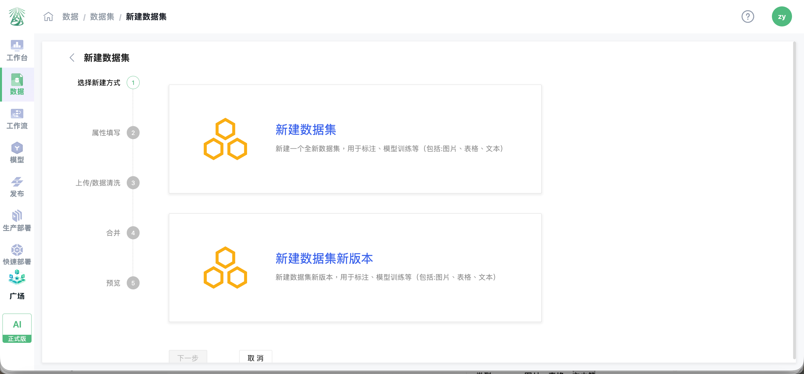

操作步骤：进入项目的数据集新建页面 -> 选择【新建数据集】->【下一步】-> 填写数据集属性，类型选择【图片】-> 来源选择【本地上传】或【数据源转存】-> 上传图片文件或图片文件夹 -> 如需同步上传标签，选择【含标签上传】并上传对应标签文件 -> 预览确认 ->【完成】。

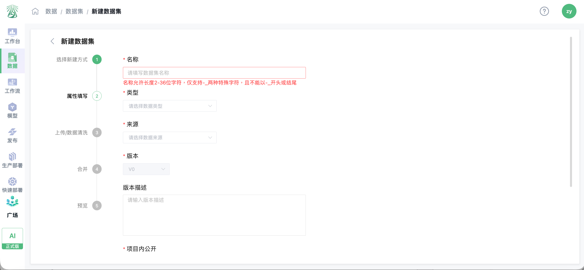

填写数据集名称时，建议使用能体现数据用途或来源的名称，便于后续在列表中查找和区分。

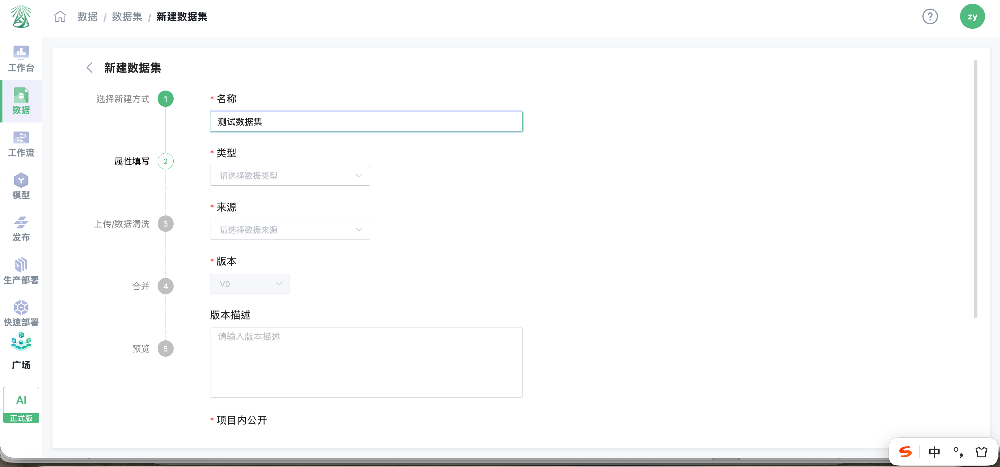

选择数据集类型时，可根据上传资源内容选择对应类别。当前支持表格、图片、文本、视频。

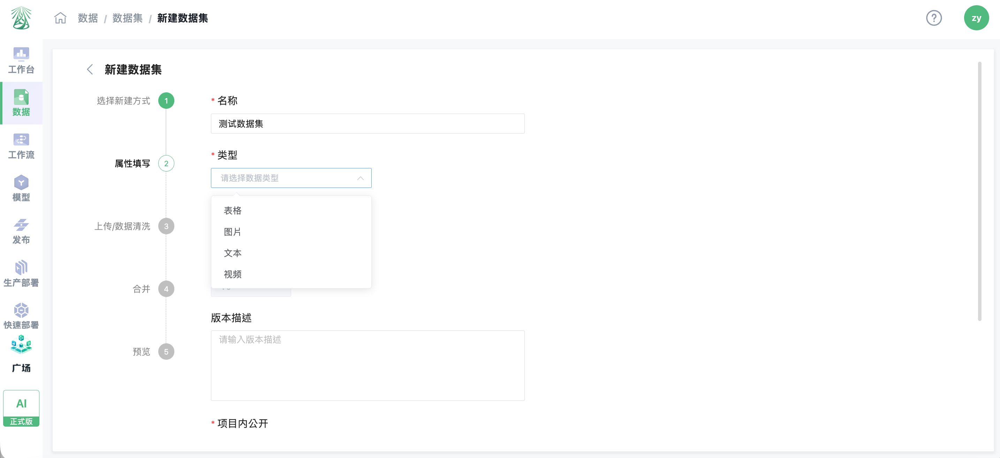

选择数据集来源时，可根据数据所在位置选择【直接上传】或【数据源转存】。

| 来源 | 说明 |
| --- | --- |
| 直接上传 | 从本地选择文件或文件夹上传到平台 |
| 数据源转存 | 从平台已配置的数据源中转存数据 |

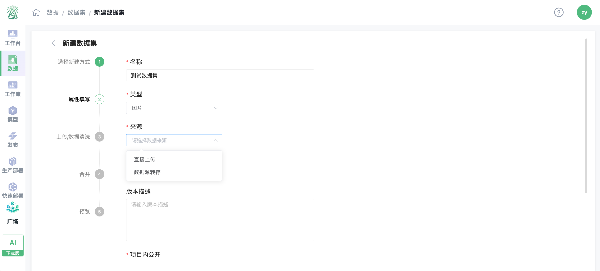

根据需要填写版本描述和简介，并选择数据集是否在项目内公开。属性配置完成后，点击【下一步】进入上传或数据清洗配置环节。

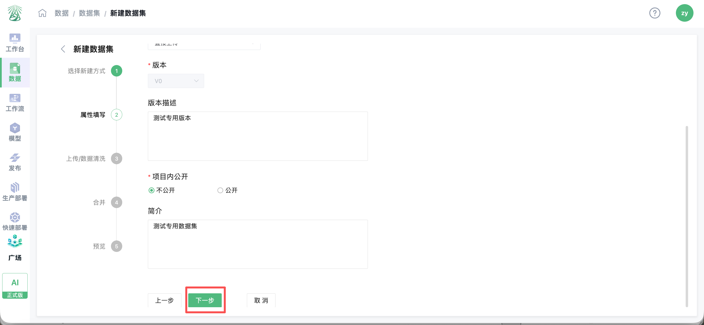

进入上传环节后，图片类型数据集支持三种上传模式：

| 上传模式 | 说明 |
| --- | --- |
| 上传文件 | 选择本地单个或多个图片文件上传 |
| 上传文件夹 | 选择本地图片文件夹批量上传 |
| 压缩包上传 | 上传包含图片文件的压缩包 |

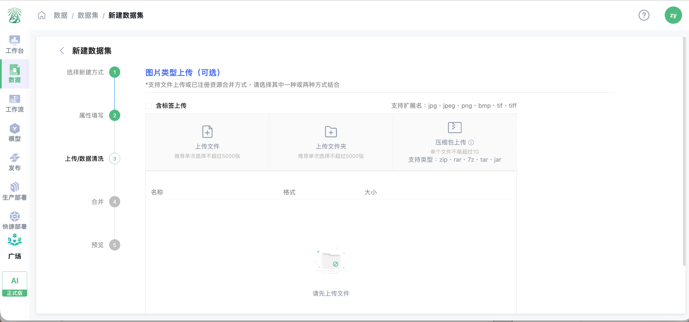

选择【上传文件夹】时，系统会打开本地文件夹选择窗口。选中需要上传的图片文件夹后，点击【上传】。

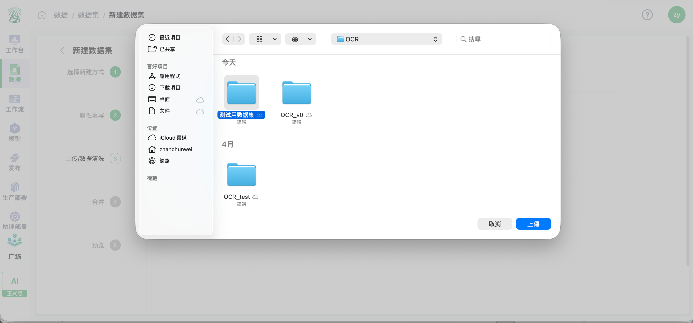

如图片已经有对应标签文件，可勾选【含标签上传】，将图片和标签一并上传，便于后续直接用于训练、预测效果检查或版本管理。

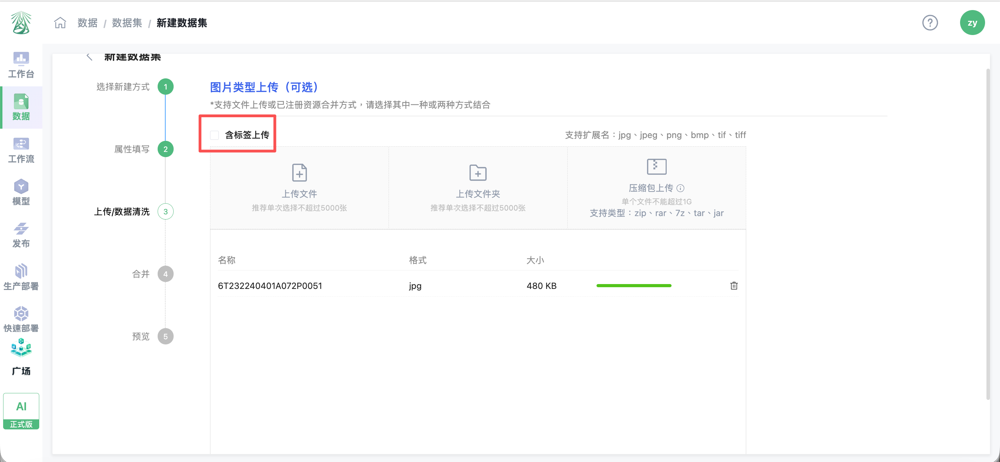

图片文件上传完成后，右侧会显示绿色对勾。若已勾选【含标签上传】，需要继续选择并上传对应标签文件。

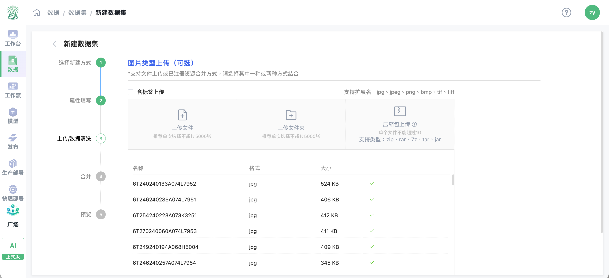

选择需要上传的标签文件或标签文件夹后，点击【上传】。

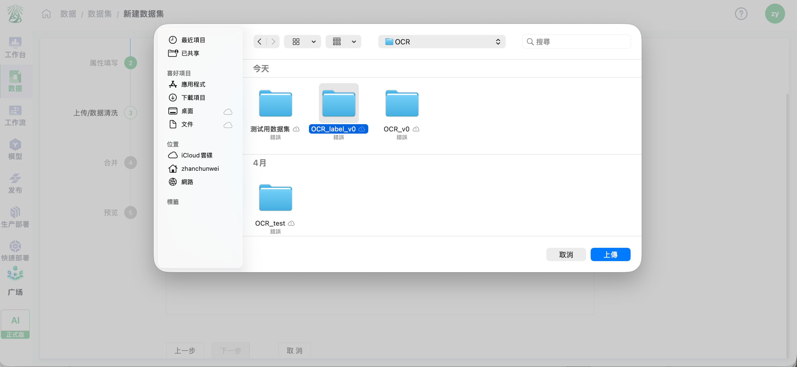

标签文件上传完成后，同样会显示绿色对勾。确认图片和标签均上传完成后，点击【下一步】继续。

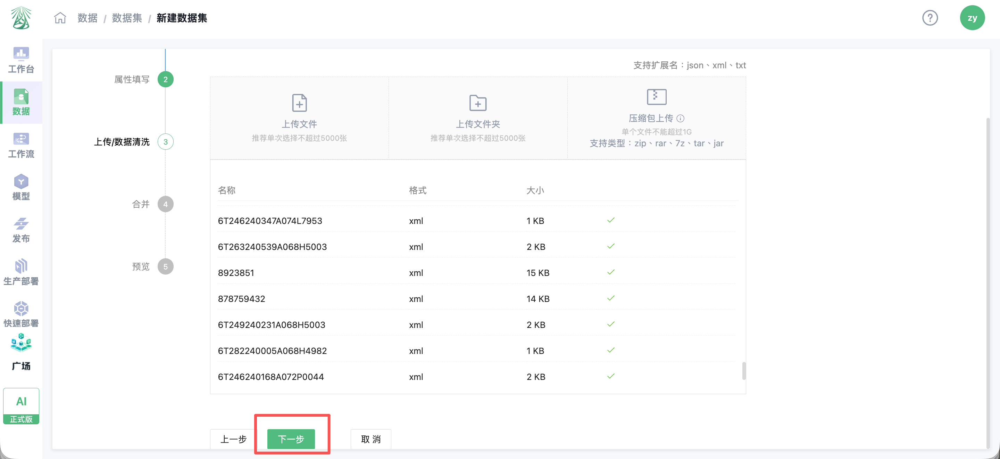

进入合并步骤后，可以选择直接提交当前上传的数据，也可以选择已有数据集进行合并。

| 合并方式 | 说明 |
| --- | --- |
| 直接上传 | 不与已有数据集合并，直接使用本次上传内容创建数据集 |
| 合并已有数据集 | 从已有数据集中选择目标数据集，将本次上传内容与其合并 |

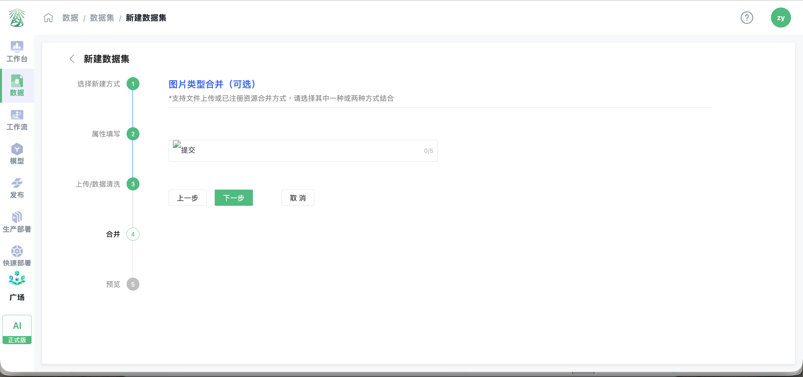

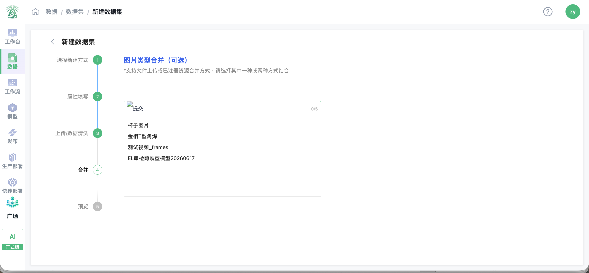

完成上传前可在预览页检查文件列表、文件格式、文件大小和图片预览效果。确认无误后，点击【完成】提交并创建数据集。

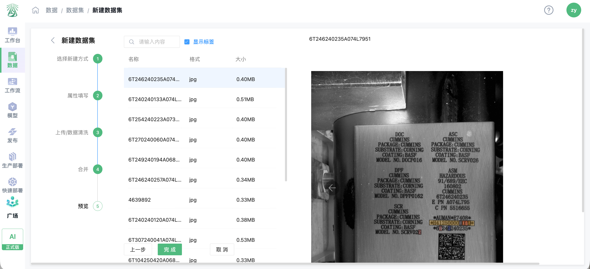

数据集创建完成后，可回到【数据集列表】中查看。列表右侧的下载按钮可用于下载数据集；点击更多操作按钮（三个点）可进行复制、更新、删除等操作。

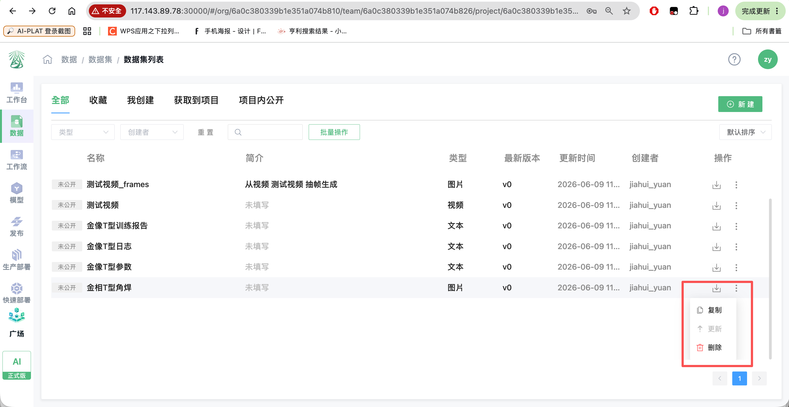

点击数据集名称可进入数据集详情页。在详情页中可以查看数据集类型、公开状态、创建者、分享状态、来源、创建时间、版本描述等详细信息，也可以切换到【预览】或【统计分析】页签查看数据内容和统计结果。

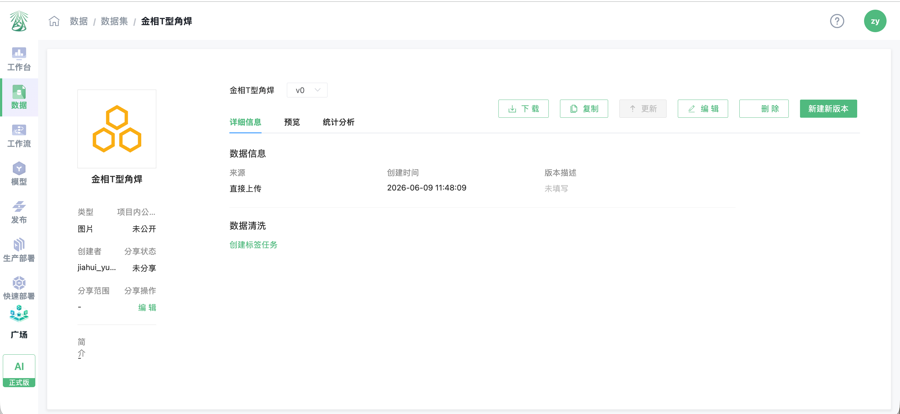

详情页上方提供数据集版本选择框。若同一数据集存在多个版本，可通过该下拉框切换查看不同版本的数据内容、详情信息和统计分析结果。

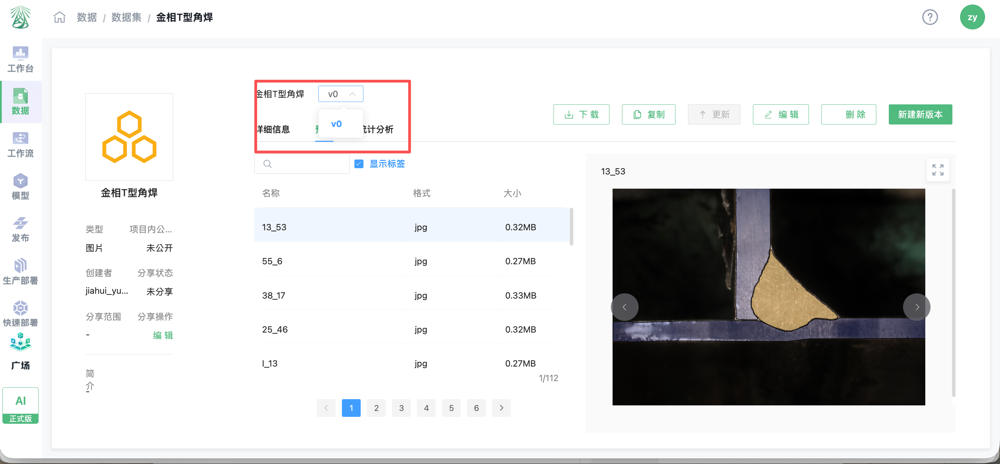

详情页右上方提供当前数据集的快捷操作按钮。用户可根据权限对当前数据集执行下载、复制、更新、编辑、删除、新建新版本等操作；当按钮置灰时，表示当前账号或当前数据集状态暂不支持该操作。

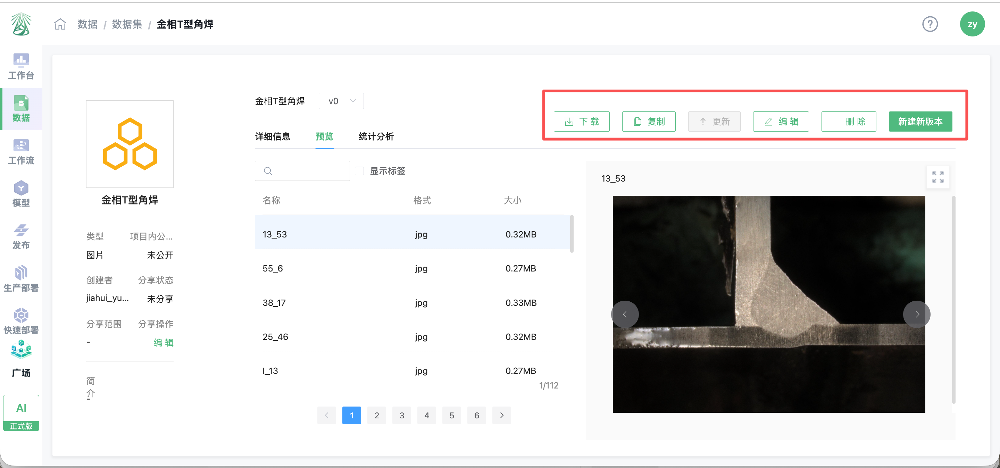

切换到【预览】页签后，可以浏览刚刚上传的数据集。左侧展示文件列表及文件格式、大小等信息，右侧展示当前选中文件的预览内容；如数据较多，可通过分页或翻页按钮继续查看。

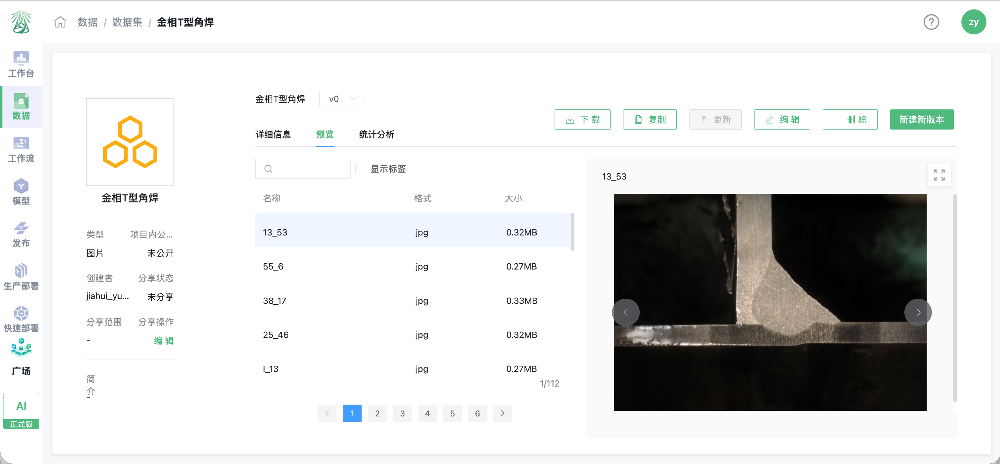

如数据集上传时包含标签文件，可在预览页勾选【显示标签】。开启后，右侧预览区域会叠加展示标签结果，便于检查图片与标签是否对应、标注区域是否准确。

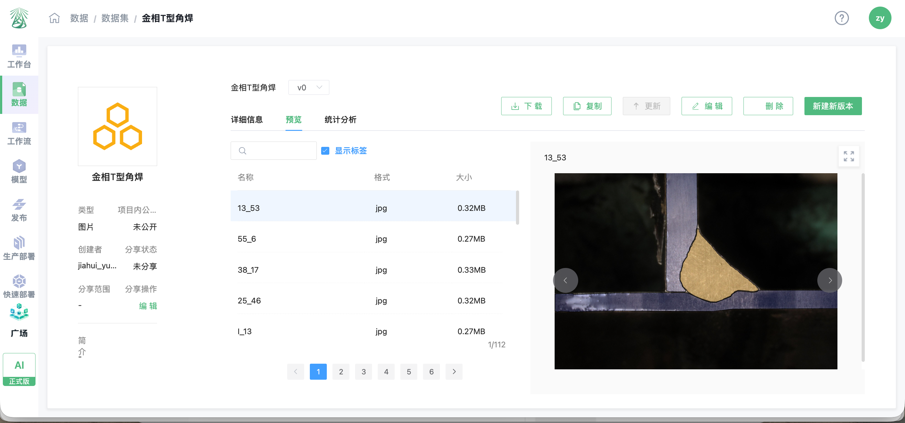

字段说明：

| 字段 | 说明 |
| --- | --- |
| 名称 | 长度 2-36 位字符，仅支持 `-`、`_` 两种特殊字符，且不能以特殊字符开头或结尾 |
| 类型 | 数据集资源类别，支持表格、图片、文本、视频 |
| 来源 | 数据进入平台的方式，支持直接上传或数据源转存 |
| 版本 | 新建数据集默认从 V0 开始 |
| 版本描述 | 用于说明当前版本内容 |
| 项目内公开 | 设置数据集是否在当前项目内公开可见 |
| 简介 | 数据集说明，可用于补充数据来源、用途、范围等信息 |

注意事项：第一次上传数据集请选择【新建数据集】。新建数据集新版本会在已有数据集基础上递增版本，例如 V0 -> V1。V0 和 V1 都会保留，使用时可选择不同版本。

### 2.3 创建表格数据集

操作步骤：进入数据集新建页面 -> 选择【新建数据集】 -> 类型选择【表格】 -> 上传表格文件 -> 根据需要配置分隔符、编码、列标题、跳过行 -> 在预览页面确认表格内容 -> 点击【完成】。

注意事项：支持 `.csv`、`.xlsx`、`.xls`。表格仅支持单个文件上传；如选择多个表格，默认使用第一个文件。

### 2.4 创建文本数据集

操作步骤：进入数据集新建页面 -> 选择【新建数据集】 -> 类型选择【文本】 -> 上传文本文件或文本文件夹 -> 根据需要选择编码 -> 在预览页面确认文本内容 -> 点击【完成】。

注意事项：支持 `.txt`、`.yml`、`.yaml`、`.pdf`、`.html`。文本仅支持单个文件上传；如选择多个文本文件，默认使用第一个文件。

### 2.5 上传模型与创建模型版本

功能用途：模型资源用于保存平台训练生成或用户自行上传的模型，后续可用于模型预测、模型发布、快速部署和生产部署。

操作入口：项目内左侧【模型】->【模型】->【新建】。

模型页面按列表展示项目内可用模型，常见字段包括名称、简介、发布数量、来源、最新版本、更新时间、创建者和操作。来源为【PLAT】的模型一般由平台工作流生成；用户也可以通过【新建】上传外部训练好的模型，上传后会进入同一个模型列表，后续可继续用于预测、发布或生产部署。

操作步骤：进入模型新建页面 -> 选择【新建模型】或【新建模型新版本】-> 填写模型属性 -> 上传模型文件 ->【完成】。

新建模型用于首次上传一个全新的模型；新建模型新版本用于在已有模型下补充新版本，便于保留版本迭代记录。

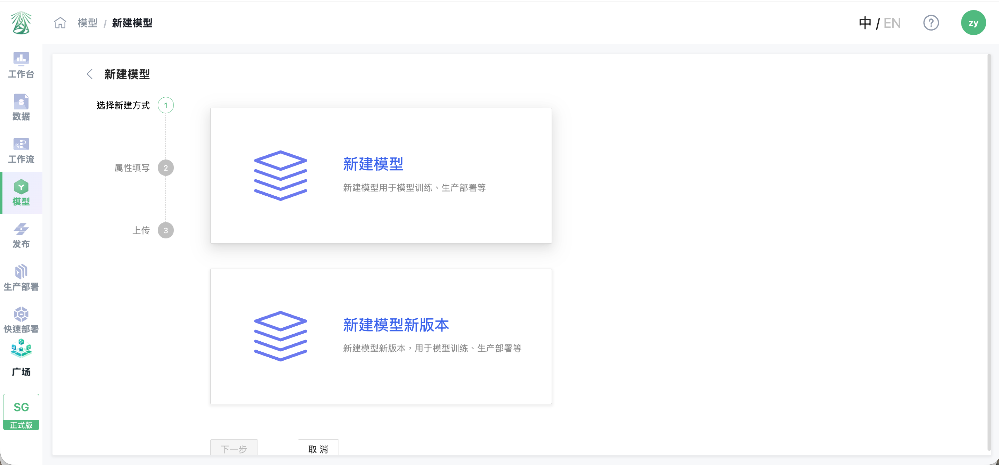

属性填写时，需要填写模型名称、任务类型、来源、模型数量、版本和版本描述等信息。任务类型应与模型能力保持一致，例如目标检测、分类或分割等。

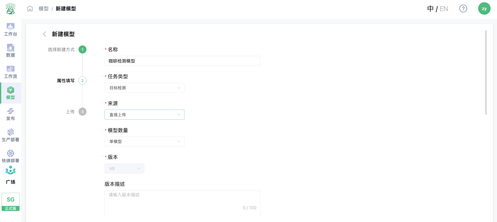

平台支持市面上主流的模型框架，可根据实际模型选择对应架构，例如 Pytorch-Detectron2、Pytorch-YOLOv5、Pytorch-YOLOv8、Pytorch-YOLO11、Pytorch-YOLO26、Pytorch-Torchvision、Pytorch-MMDet、Pytorch-MMSeg 等。模型架构需要与上传文件的训练框架匹配，否则可能无法正确推理或部署。

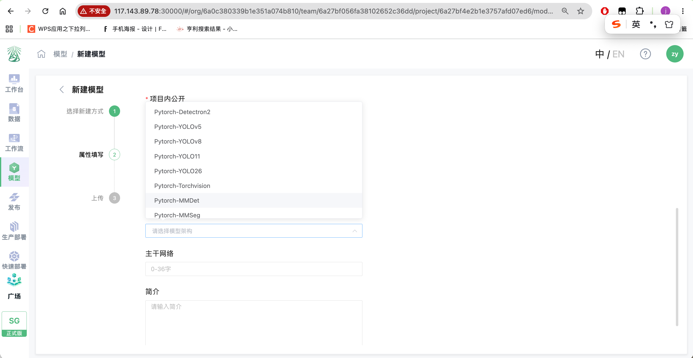

上传检测或识别类模型时，需要配置模型识别的类别名称。类别名称应与训练时使用的类别保持一致，后续预测、发布和部署都会基于这些类别进行结果展示。

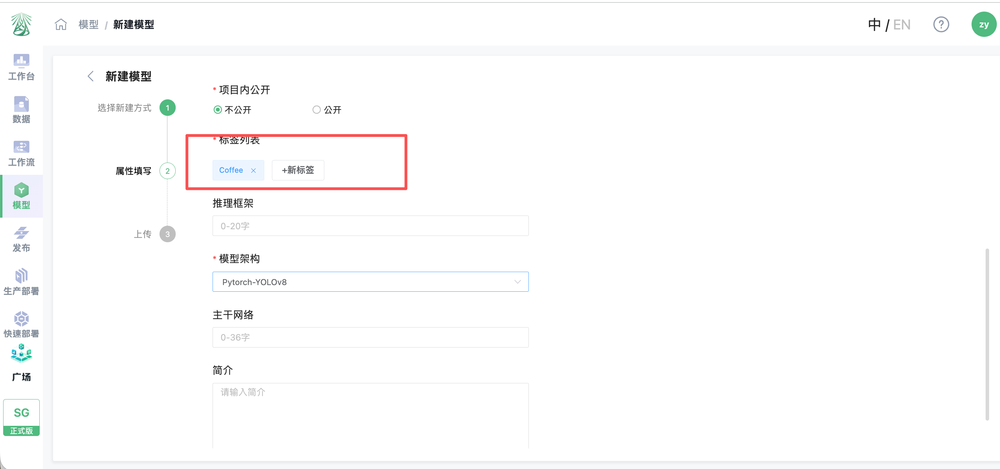

上传文件时，平台支持 `.pkl`、`.pth`、`.pb`、`.ckpt`、`.onnx`、`.trt` 等格式。若模型文件格式不在支持范围内，建议先在线下转换为平台支持的格式后再上传。

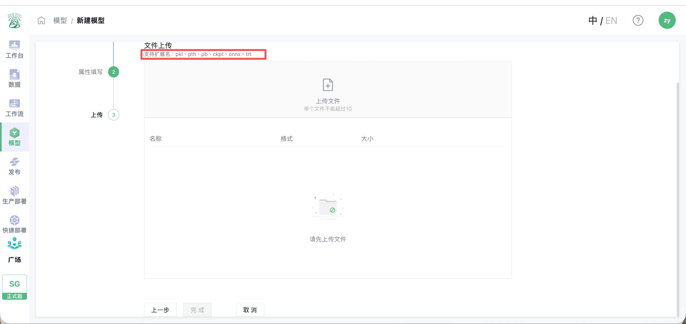

注意事项：模型仅支持单个文件上传；如选择多个模型文件，默认使用第一个文件。第一次上传模型请选择【新建模型】；对已有模型迭代时请选择【新建模型新版本】。

### 2.6 下载、复制与删除资源

下载入口：进入项目后点击左侧【数据】或【模型】，在列表中点击资源右侧下载图标；也可以进入数据集或模型详情页，点击【下载】。

### 2.7 结果检查

确认目标数据集或模型已出现在项目列表中，并核对资源名称、版本、来源、预览内容和访问权限。

---

## 下一步操作

如需要人工标注图片，请继续阅读《03 数据标注与审核》；如数据已准备完成，可进入工作流和训练章节。
