# AI-PLAT 用户手册

## 04 工作流编排与运行

本章介绍通用工作流的创建、组件连接、输入输出配置与运行管理方法，是数据处理、训练和预测操作的共同基础。

---

### 4.1 工作流与组件关系说明

工作流通过组件、资源和连线串联具体任务。开始前请确认输入数据、目标输出和所需组件均已准备完成。

### 4.2 创建图像处理工作流

功能用途：用于对原始图片进行切图、亮度调整、对比度调整等预处理，使图片满足模型训练条件。若图片已经标注，标签文件有时也需要对应处理。

前期准备：已加入项目、已上传待处理图片、如有标签需准备与图片一一对应的标签文件、已获取图像处理组件，例如【固定区域切图】。

数据要求：图片格式为 `.jpg`、`.png`、`.bmp`；目标检测和分类标签常用 `.xml`；图像分割标签支持 `.xml` 或 `.json`。

操作步骤：上传待处理图片和标签资源 -> 从市集获取图像处理组件至项目 -> 进入项目【工作流】->【新建】-> 选择【新建工作流】或从模板库选择已有模板 -> 填写工作流名称、概述、说明 ->【完成】-> 进入工作流画布 -> 将输入资源、图像处理组件、输出资源拖拽到画布 -> 连接节点 -> 配置输入输出资源 -> 配置组件参数 ->【保存】->【运行】-> 选择运行设备 -> 查看日志 -> 查看或下载输出资源。

进入项目后，点击左侧菜单【工作流】，在工作流列表右上角点击【新建】。

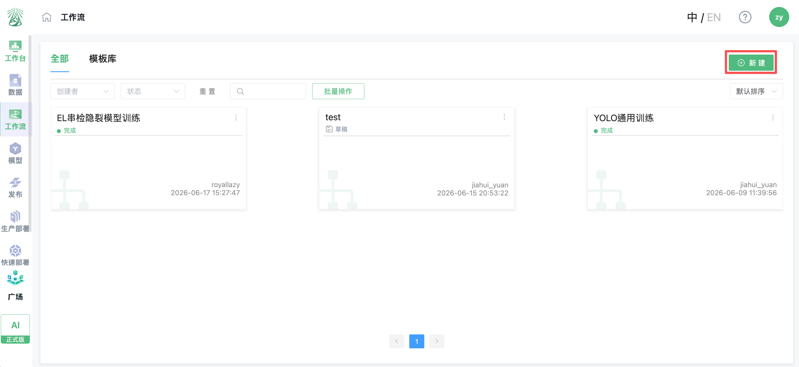

进入流程选择页面后，可以选择【新建工作流】从空白画布开始搭建，也可以进入【模板库】选择已有模板创建。选择【新建工作流】后，点击【下一步】。

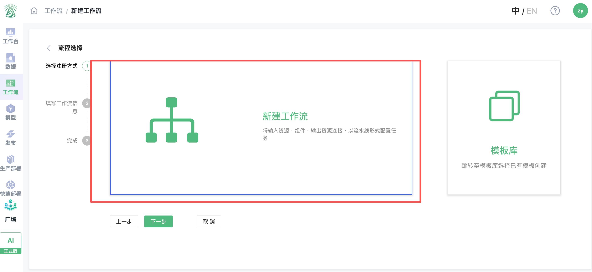

在填写工作流信息页面，依次填写名称、概述和说明。名称用于在工作流列表中识别该流程，概述用于简短描述工作流用途，说明可补充工作流的使用场景或处理目标。填写完成后点击【完成】。

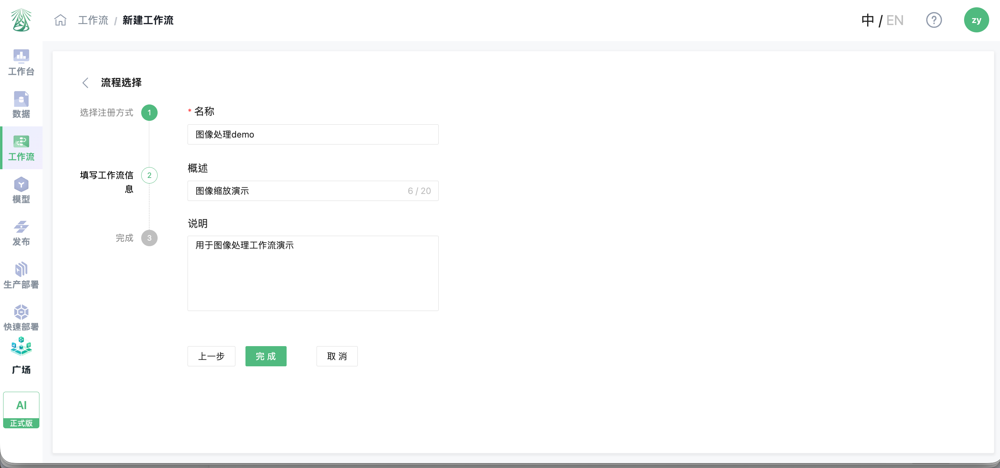

点击【完成】后，系统会自动跳转到工作流画布页面。画布左侧会展示工作流基本信息、输入资源、输出资源和组件列表，中间区域用于搭建流程，顶部工具栏提供上一步、下一步、编辑、复制、粘贴、删除、运行、保存、另存为模板等操作。后续可在画布中添加输入资源、处理组件和输出资源，开始搭建图像处理工作流。

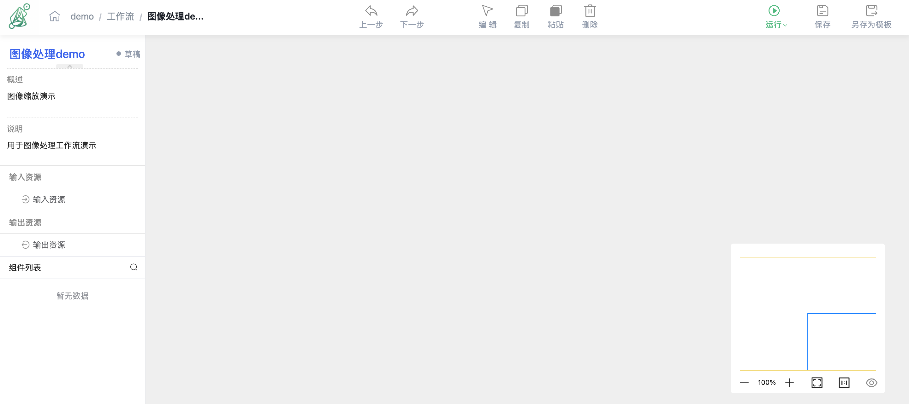

在画布左侧可以找到【输入资源】【输出资源】以及已获取到项目中的组件。搭建工作流时，可通过拖拽方式将所需节点放入画布：先拖入输入资源，再拖入数据处理组件，例如【图像预处理（放缩）】，最后拖入输出资源。不同组件对输入、输出资源的数量要求不同，需按照组件要求放置对应数量的输入资源和输出资源。

节点放置完成后，将上一个节点的输出端连接到下一个节点的输入端，形成完整处理链路。图像处理类工作流通常为“输入资源 -> 图像处理组件 -> 输出资源”的结构；连接完成后，再继续配置各节点的资源和组件参数。

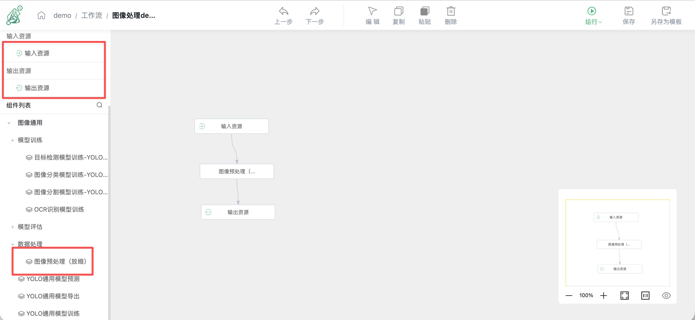

工作流搭建完成后，需要继续配置输入资源、输出资源和组件参数。将鼠标悬浮在节点连接口的圆点上，页面会提示该接口需要的数据格式，例如 `image`，用于确认上下游节点的数据类型是否匹配。

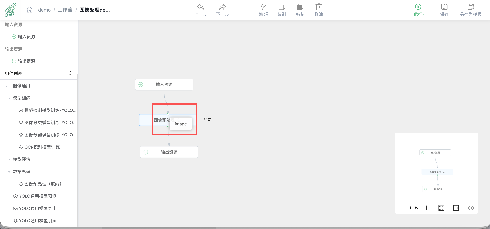

也可以点击画布中的组件进入【组件配置】页面查看配置内容。组件配置页面上方包含【基本信息】【输入输出资源】【运行配置】【参数配置】【更多配置】等页签。

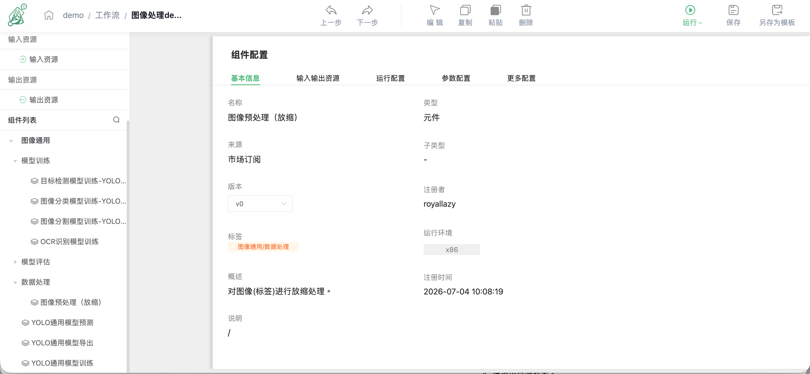

【输入输出资源】页签用于查看当前组件要求的输入资源和输出资源格式。例如图像处理组件通常要求输入资源为图片，输出资源也为图片。配置工作流时，应确保画布中连接的输入、输出资源类型与组件要求一致。

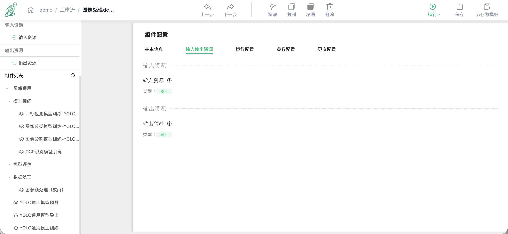

【运行配置】通常由组件在搭建时默认配置完成，一般无需调整。若组件提供【参数配置】，则可根据实际处理目标进行自主调整，例如图像缩放比例、处理方式或其他组件参数。

【更多配置】不是所有组件都会提供，一般为进阶配置项，默认情况下不会暴露或不需要调整。普通数据处理流程保持默认即可。

配置输入资源时，点击画布中的【输入资源】节点，在右侧或弹出的配置区域选择需要进行图像处理的数据集。选择完成后，点击画布空白处即可完成该节点配置。

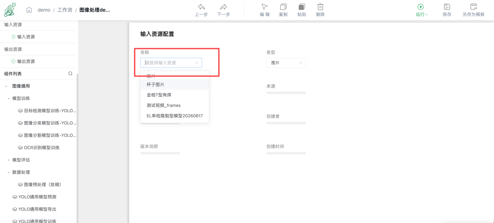

配置输出资源时，点击画布中的【输出资源】节点。输出资源可以选择创建一个新的数据集，也可以选择为已有数据集创建一个新版本。以创建新数据集为例，选择【新数据集】后进入下一步。

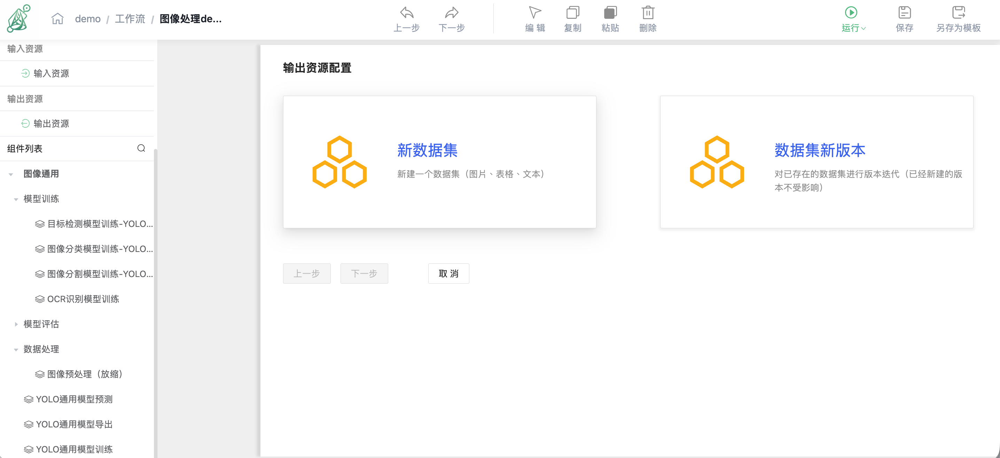

在输出资源配置页面填写新数据集名称，并确认类型、版本、简介和版本说明等信息。页面内容较多时，需要向下滚动到页面底部。

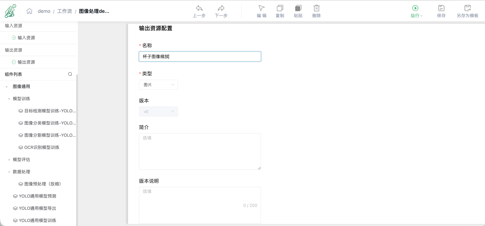

确认无误后，点击底部【完成】创建输出数据集，并返回工作流画布。

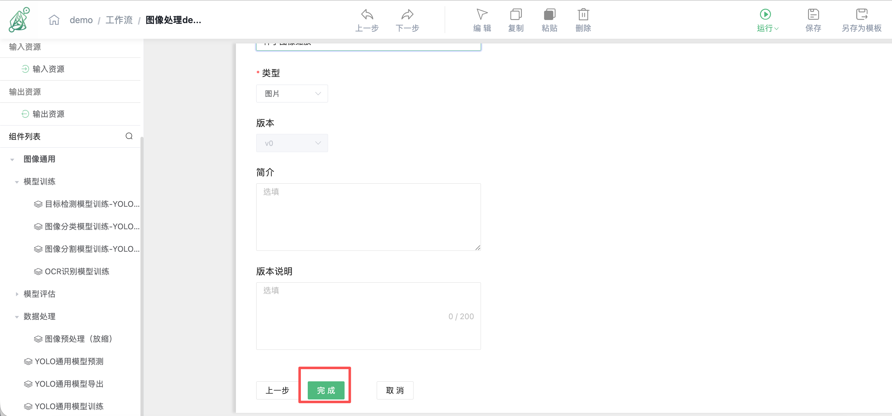

工作流搭建和配置完成后，建议先点击右上角【保存】。这是一个很好的习惯，可以避免因网络波动、页面关闭或误操作导致工作流结构和配置丢失，需要重新搭建。

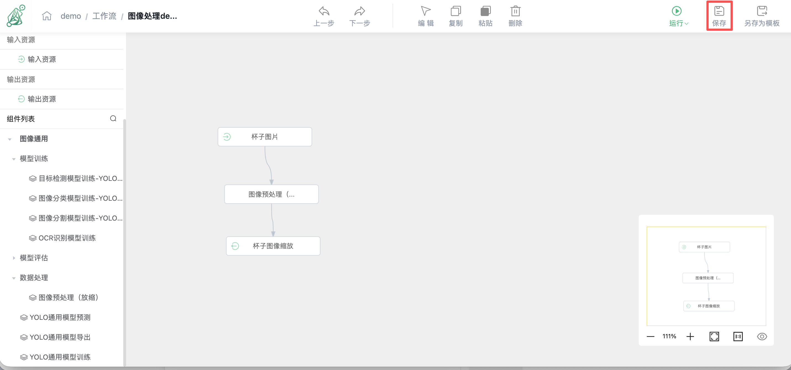

检查工作流节点、资源和组件参数无误后，点击右上角【运行】。根据当前项目已分配设备的资源占用情况，可以选择【立即运行】或【预约运行】。

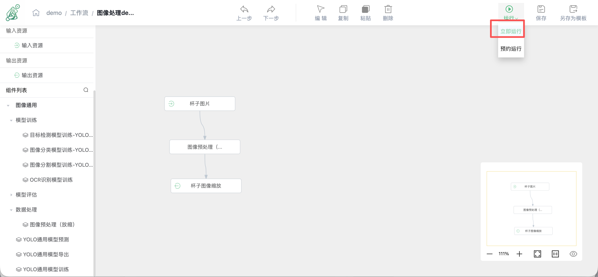

选择【立即运行】后，需要选择已分配到当前项目中的设备资源作为运行算力，然后点击【运行】开始任务。若设备被占用，可以选择预约运行；若没有可用设备，请联系管理员添加或分配设备。

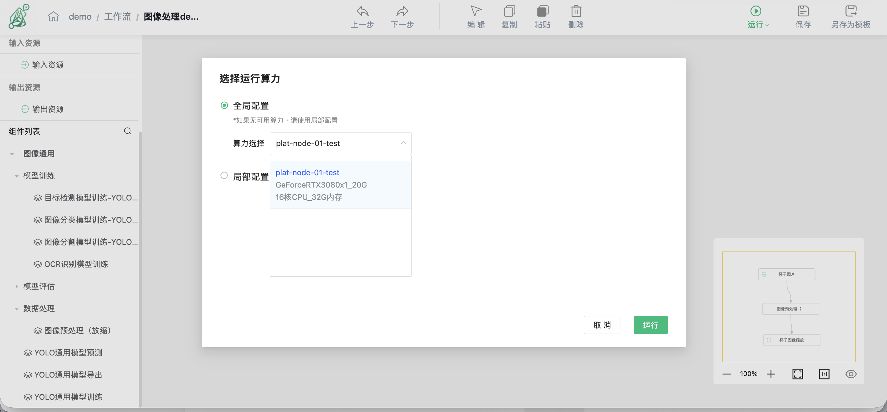

选择【预约运行】时，可以设置任务开始日期和开始时间。平台会根据所选时间安排任务运行，适合在设备繁忙时预约空闲时段执行。

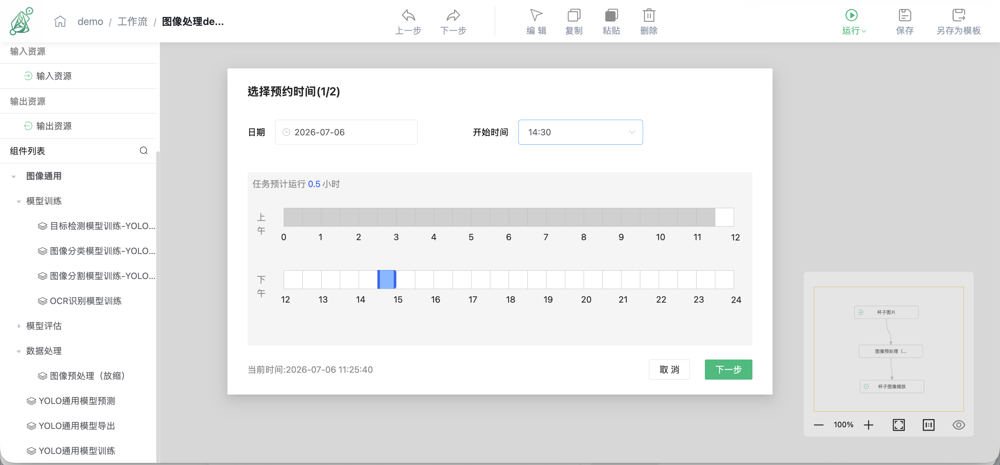

任务开始后，右上方会出现【终止】按钮，可用于停止当前任务；组件节点右侧会显示实时完成进度，便于观察任务当前处理状态。

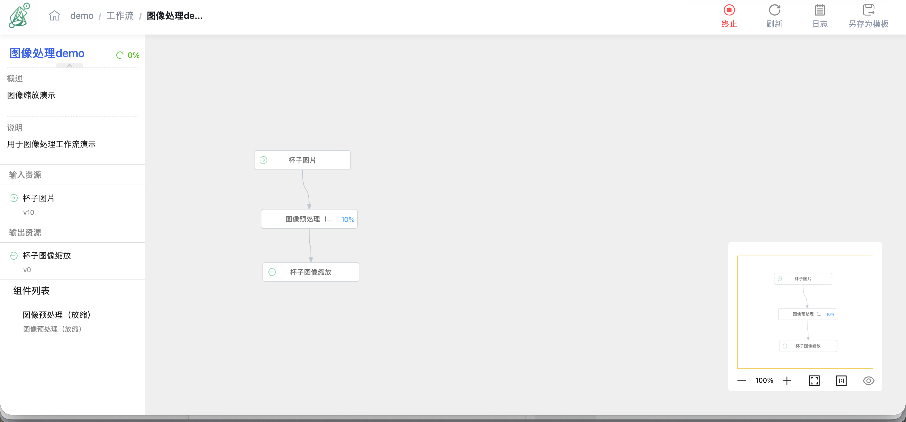

运行过程中，可点击组件节点旁的【日志】查看实时运行状态和报错信息。日志中会展示处理时间、处理进度、文件处理情况等内容，可用于排查组件是否正常运行。

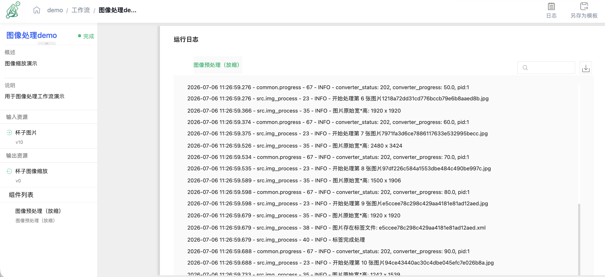

任务完成后，组件节点会显示绿色对勾，表示该组件已运行完成。也可以继续点击【日志】查看完整运行记录。

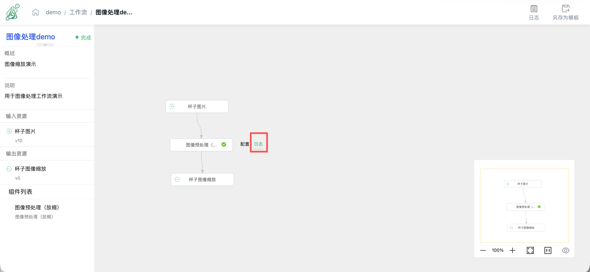

工作流运行后，也可以回到【工作流】列表查看当前任务运行进度和状态。

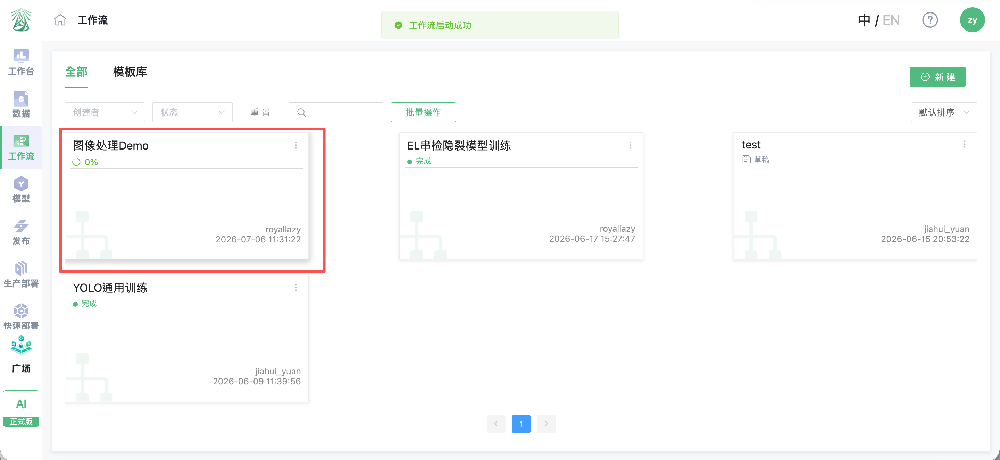

处理完成后，可进入【数据】->【数据集】页面，找到本次工作流生成的新数据集。

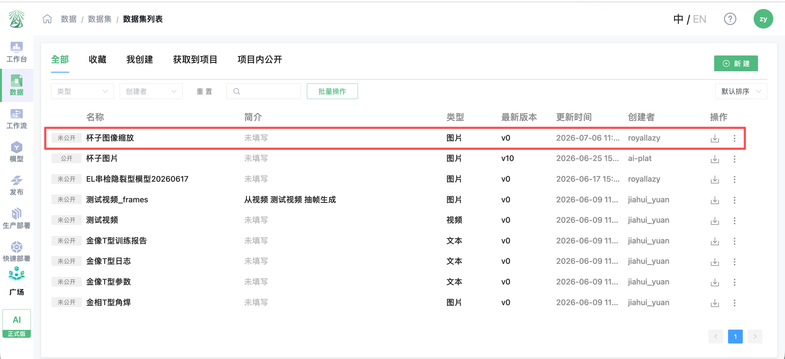

注意事项：概述长度不超过 20 个字符。如项目内无设备，请联系运维人员添加设备。

### 4.3 立即运行、预约运行与设备选择

| 运行方式 | 说明 |
| --- | --- |
| 立即运行 | 工作流配置完成后立即运行，较短时间内输出结果 |
| 预约运行 | 预约 7 天内的可用时间段运行，便于利用空余算力 |

立即运行：工作流绘制完成并配置参数后，点击【运行】->【立即运行】-> 选择运行设备 -> 开始运行。

预约运行：工作流绘制完成并配置参数后，点击【运行】->【预约运行】-> 选择 7 天内日期和开始时间 -> 点击【预约】。预约成功后，页面会显示任务开始时间和预计运行时间。

设备选择说明：全局配置为整个工作流选择运行设备；局部配置为工作流内单个组件选择运行设备。如项目内无可用设备，请联系运维人员添加或分配设备。

### 4.4 结果检查

运行结束后，请查看工作流状态、元件日志和输出资源；异常时优先核对组件参数、资源格式和算力设备。

---

## 下一步操作

需要生成新模型时，请继续阅读《05 模型训练与预测验证》。
