# AI-PLAT 用户手册

## 06 模型发布与快速部署

本章用于将验证通过的模型发布为可选资产，并通过临时 Demo 或 API 部署进行展示、联调和效果验证。

---

### 6.1 发布前检查

发布前请确认模型版本、标签类别、适用场景和适用范围准确，并确认模型已完成必要的效果验证。

### 6.2 发布模型与查看状态

功能用途：用于将训练或测试通过的模型发布到平台发布管理中。模型发布后会形成可管理的发布记录，后续可用于快速部署、生产部署或对外服务验证。

适用角色：AI 生产工程师通常负责提交模型发布；项目管理员或具备审批权限的管理员负责确认发布信息、审批发布记录，并管理模型上架、下架或取消发布等操作。

操作入口：项目内【模型】->【模型】-> 点击需要发布的模型。

操作步骤：

1. 进入项目左侧【模型】页面，在模型列表中找到需要发布的模型。发布前建议重点核对模型名称、来源、最新版本、更新时间、创建者和发布数量，确认当前选择的是计划对外验证或部署的模型版本。确认无误后，点击模型名称进入详情页。

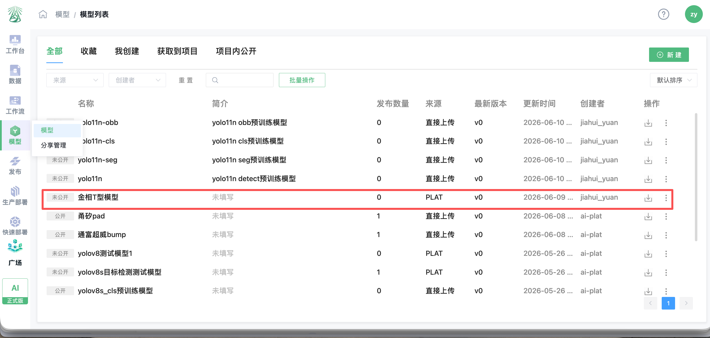

2. 在模型详情页查看当前模型版本、模型框架、标签列表和发布状态。确认模型信息无误后，在【发布信息】区域点击【发布】。

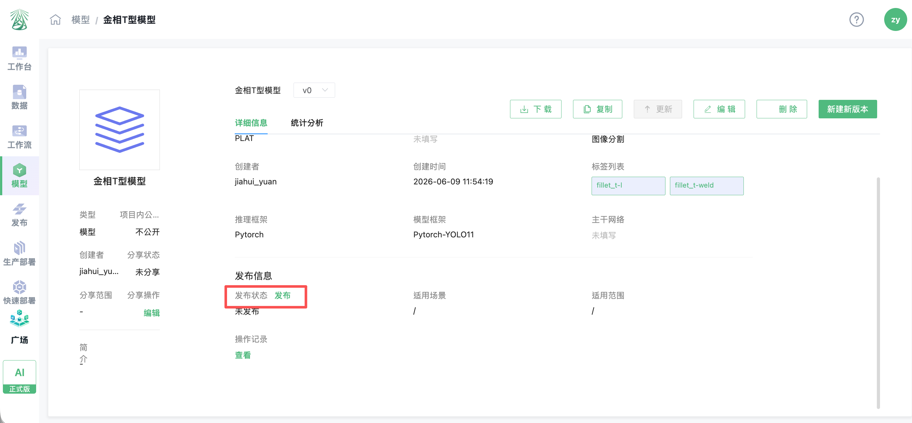

3. 在发布弹窗中填写发布信息，包括简介、适用场景、适用范围等。标签列表、推理框架和模型框架会根据当前模型信息展示，通常无需手动修改。填写完成后再次核对模型版本、标签类别、推理框架和适用范围，确认无误后点击【发布】提交。

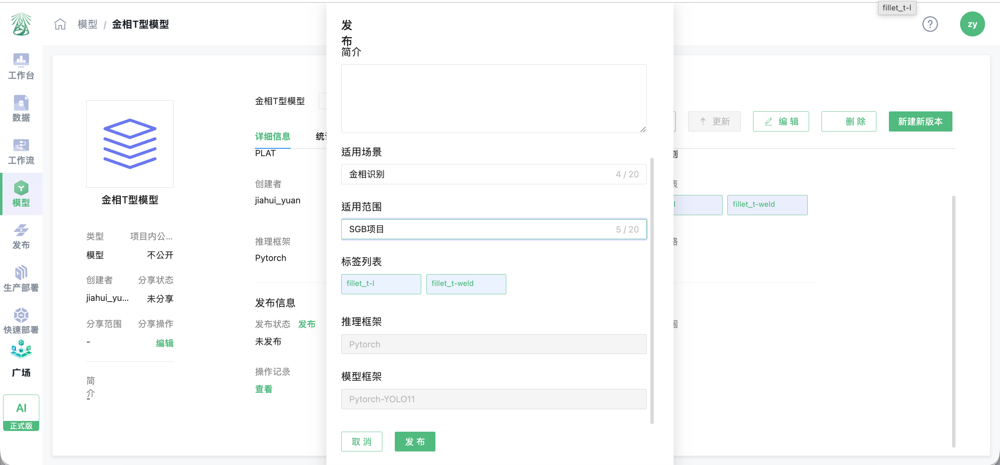

4. 提交发布后，平台会根据当前账号权限和项目发布规则处理发布记录。具备管理员权限的账号通常可直接完成发布；普通成员提交后，可能需要管理员审批。审批通过后，模型详情页的发布状态会变为【已发布】。如后续不再使用该发布模型，可在同一区域点击【取消发布】。

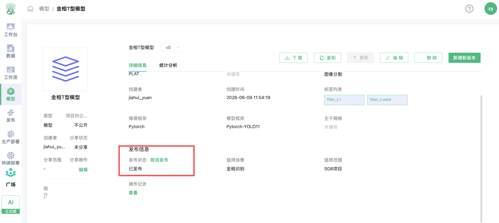

5. 点击左侧【发布】进入发布列表，可查看刚刚发布的模型。列表中会展示名称、简介、状态、适用场景、适用范围、版本、发布时间和操作入口。

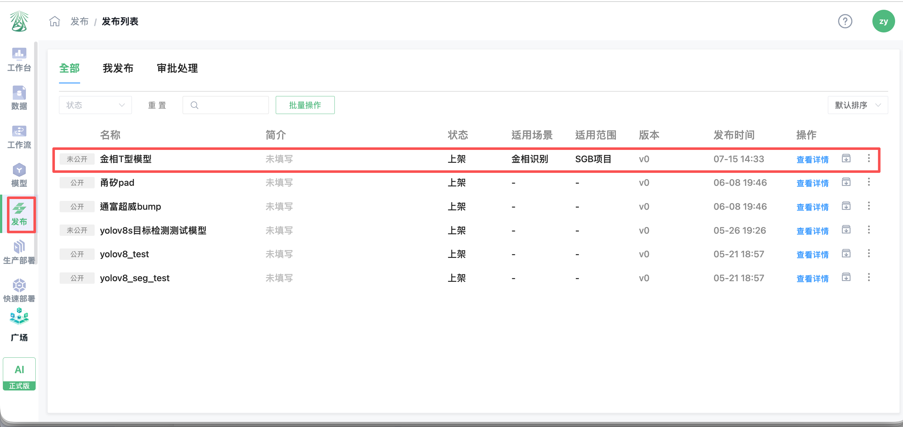

6. 发布记录可作为后续快速部署、API 部署或生产部署的模型来源。若发布记录未审批通过、未上架或已取消发布，后续部署页面可能无法选择该模型，需先完成发布管理中的状态确认。

配置说明：

| 配置项 | 说明 |
| --- | --- |
| 简介 | 用于补充说明模型能力、适用对象或使用注意事项，可按实际情况填写 |
| 适用场景 | 描述模型主要解决的业务场景，如金相识别、缺陷检测、目标识别等 |
| 适用范围 | 描述模型适用的项目、产线、客户或业务范围，便于后续检索和管理 |
| 标签列表 | 展示当前模型支持识别的类别。发布前应确认标签名称与模型训练时使用的类别一致 |
| 推理框架 / 模型框架 | 根据当前模型信息自动展示，一般无需修改 |
| 发布状态 | 未发布时可点击【发布】；提交后可根据权限进入待审批或已发布状态；已发布后可在详情页点击【取消发布】 |

注意事项：

- 发布前应确认模型版本、标签类别、适用场景和适用范围填写准确，避免后续部署时选择错误模型。
- 普通成员提交发布后，如页面提示需要审批，请联系项目管理员或发布管理员处理。
- 已发布模型会出现在【发布】模块中，后续快速部署、生产部署或模型服务验证时可从发布列表中选择。
- 取消发布或下架会影响后续部署选择。对已在使用中的模型执行此类操作前，应先确认是否存在关联的 Demo、API 服务或生产部署任务。

### 6.3 创建快速 Demo 或 API 部署

功能用途：快速部署用于对已发布并上架的模型进行在线验证和临时展示，帮助研发、算法或业务人员以简化流程检查当前模型的检测能力。快速 Demo 的使用方式与模型预测工作流相近，适用于快速查看模型对测试图片的识别效果，不作为长期在线服务。

使用场景：通过快速 Demo 完成在线效果验证或现场演示；通过 API 部署获取临时调用凭证，进行本地调试和模型服务调用验证。

操作入口：项目内左侧【快速部署】。页面提供【快速 Demo】和【API 部署】两个页签，可按验证方式查看部署记录，并使用【新建】创建部署。

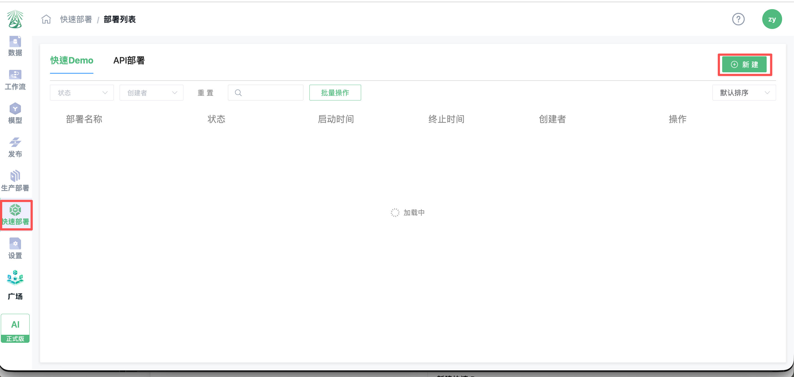

部署方式说明：

| 部署方式 | 用途 | 适用场景 |
| --- | --- | --- |
| 快速 Demo | 为模型创建可在线访问的临时演示页面 | 在线测试模型效果、向业务人员展示检测能力 |
| API 部署 | 为模型创建临时调用凭证 | 本地调试、接口联调和程序化调用验证 |

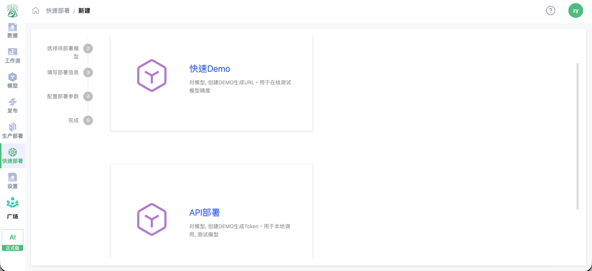

注意事项：快速 Demo 为临时部署，限制时长最长为 2 小时。到达限制时长后，平台将停止该部署；如不再需要，应及时手动终止以释放算力资源。Web 页面形式的快速 Demo 目前仅支持目标检测模型；API 调试支持目标检测、分类、分割三种应用场景。

#### 6.3.1 新建快速 Demo

操作入口：项目内【快速部署】->【新建】->【快速Demo】。

操作步骤：

1. 进入项目左侧【快速部署】，在【快速 Demo】页签点击【新建】。在部署方式选择页面点击【快速 Demo】。
2. 在【选择待部署模型】步骤中，选择已发布并上架的模型及对应版本。模型下拉列表仅展示当前账号有权限使用的发布模型；如未找到目标模型，请先在【发布】中确认模型已完成发布和上架。

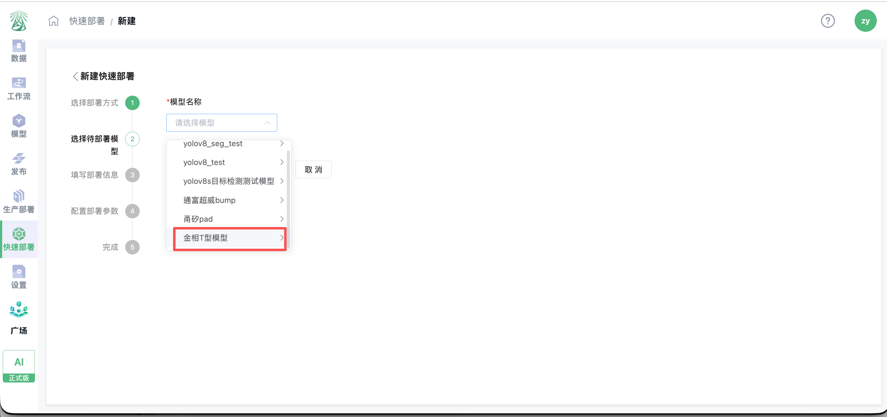

3. 在【填写部署信息】步骤中填写部署名称，选择限制时长，并选择可用于快速部署的训练算力资源。限制时长应满足现场验证或演示需要，最长不得超过 2 小时。

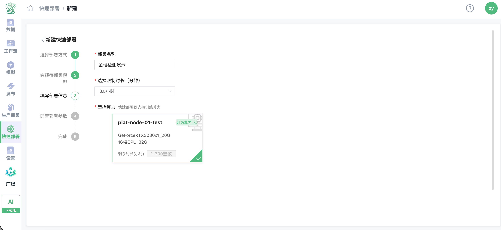

4. 在【配置部署参数】步骤中，为模型输出标签配置置信度阈值。阈值表示目标检测结果需要达到的最低置信度：只有置信度高于所设阈值的目标才会在 Demo 中展示。阈值越高，展示结果通常越严格；阈值越低，可能展示更多候选目标。应结合模型测试结果和现场展示要求设置。

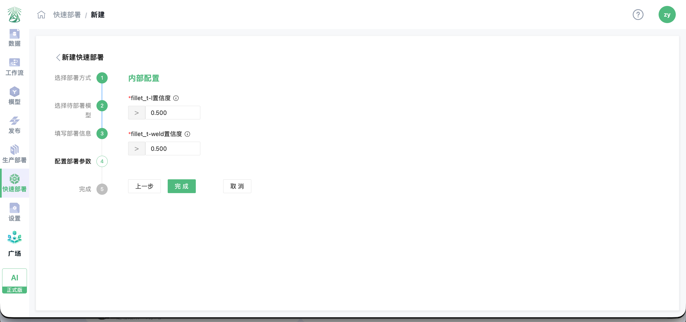

5. 确认配置后点击【完成】。平台将创建并启动临时部署，随后自动进入部署详情页。若算力资源正在排队或启动中，可在详情页查看当前状态、剩余时长和运行信息；启动完成后，可使用页面提供的 Demo 访问地址进行在线验证或演示。

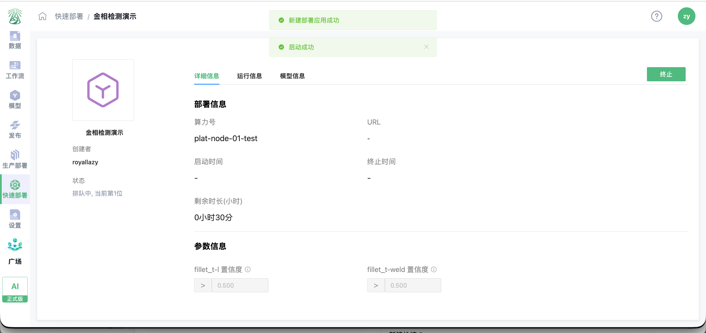

6. 完成验证或演示后，在部署详情页点击【终止】。终止后，该快速 Demo 不再运行；如需再次使用，应重新创建部署或按平台页面指引重新启动。

快速 Demo 页面通常包含图片上传、图片展示和模型识别结果等区域，可用于直观检查当前模型的检测效果。实际可上传文件数量、支持格式和结果展示形式以平台页面提示为准。

使用建议：

- 快速 Demo 仅应选择已完成效果检查、适合对外展示的模型版本。
- 选择算力资源前，应确认资源处于可用状态并满足当前模型的运行要求。
- 调整阈值后，应使用具有代表性的测试图片复核漏检和误检情况，避免仅依据单张图片判断模型效果。
- 快速 Demo 仅用于临时验证和演示。需要长期稳定运行、持续对外提供服务时，应使用生产部署能力。

#### 6.3.2 新建 API 部署

操作入口：项目内【快速部署】->【新建】->【API部署】。

操作步骤：进入项目【快速部署】->【新建】->【API部署】-> 选择模型发布名称 -> 填写部署名称，平台自动生成 Token -> 选择限制时长和设备 -> 配置模型类别和置信度阈值 ->【完成】-> 启动成功后复制 Token，用于本地调试。

API 部署详情页通常包含部署信息、Token、启动时间、终止时间、剩余时长、接口用例、参数信息、运行历史和模型信息。

### 6.4 验证、终止与释放临时部署

完成展示或接口联调后，请核对部署状态、访问结果和剩余时长；不再使用时及时终止临时部署，释放算力资源。

---

## 下一步操作

如需为业务系统长期稳定提供服务，请继续阅读《07 生产部署与运维管理》。
