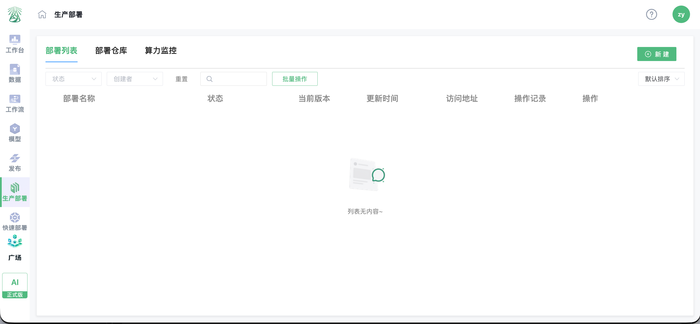
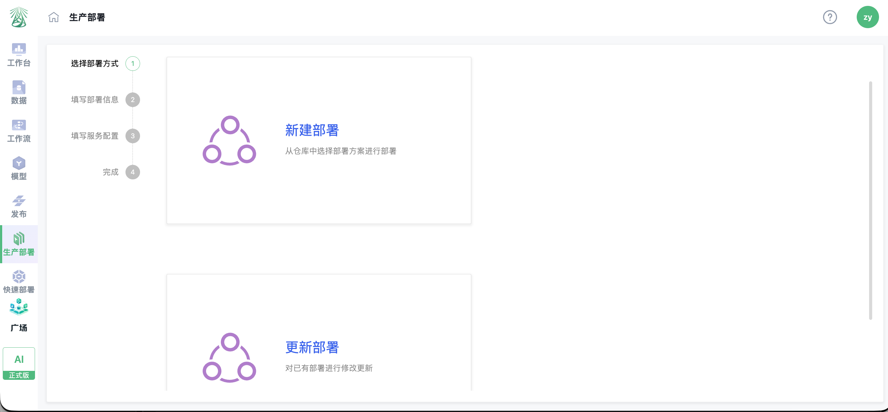
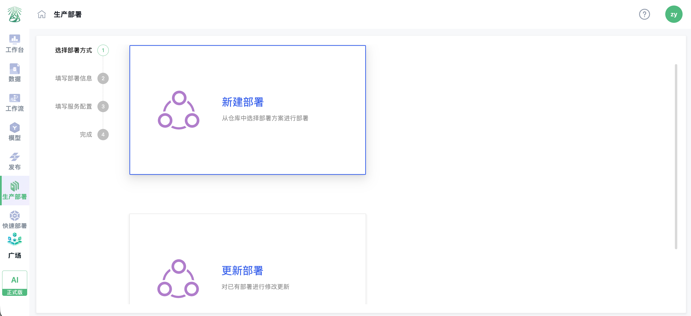

# AI-PLAT 用户手册

## 第二部分 · 07 生产部署与运维管理

本章面向长期运行的业务服务，说明部署准备、服务创建、首次验证、状态监控、更新回退和安全注意事项。

---

### 7.1 生产部署适用场景与角色

生产部署适用于已完成模型验证、需要稳定对外提供接口的场景。AI 生产工程师负责准备模型和部署方案，运维人员负责资源、日志和运行状态，项目管理员负责权限与变更管理。

### 7.2 部署前准备与产品获取

功能用途：生产部署用于将已编写完成、可用于生产环境的推理服务部署到平台并长期运行。部署启动成功后，平台会为服务生成访问地址，业务系统或调用方可通过该 API 接口调用模型检测服务。

适用角色：AI 生产工程师负责准备推理服务、部署方案和模型版本；运维人员负责核对算力资源、服务状态和运行日志；项目管理员负责部署权限、变更审批及生产使用管理。

使用场景：已完成模型效果验证并具备生产推理服务的项目，需要持续对外提供检测能力；或需要在平台内统一管理服务访问地址、运行状态、版本更新与运维记录。

操作入口：项目内左侧【生产部署】。页面包含【部署列表】、【部署仓库】和【算力监控】三个页签；在【部署列表】中可按状态、创建者或名称筛选部署，并查看部署名称、状态、当前版本、更新时间、访问地址和操作记录。

部署前准备：

- 已确认推理服务适用于生产环境，并完成必要的功能、性能和安全性验证。
- 已准备可用的部署方案或已将部署方案加入项目部署仓库。
- 已确认待使用的模型版本、模型文件、运行参数和算力资源。
- 已明确接口调用方、访问权限及服务变更的通知范围。

### 7.3 获取产品至项目

操作入口：市集【公共产品库】-> 产品 ->【获取】。

操作步骤：进入市集 -> 打开【公共产品库】-> 找到目标产品 -> 点击【获取】-> 在弹窗中选择目标项目 -> 点击【确认】。

注意事项：AI-PLAT 项目仅支持关联单个产品，产品关联后通常不支持修改。

### 7.4 新建或更新生产部署

操作入口：项目内【生产部署】-> 部署仓库 ->【新建部署】，或项目内【生产部署】->【新建】。

操作步骤：

1. 进入项目左侧【生产部署】，在【部署列表】或【部署仓库】中点击【新建】。
2. 在【选择部署方式】步骤中选择【新建部署】。如需对已有生产服务进行版本或配置变更，可选择【更新部署】；更新前应评估对现有接口调用方的影响。

3. 在【填写部署信息】步骤中填写部署名称，并选择目标部署方案及服务。部署名称应能识别业务用途、服务对象或环境，便于后续检索、告警和变更管理。
4. 在【填写服务配置】步骤中，按部署方案要求选择模型版本、配置服务运行参数，并选择算力资源或实例配置。应确保模型框架、服务依赖、算力规格和资源配额满足推理服务的运行要求。
5. 核对部署信息和服务配置后点击【完成】。平台创建部署并启动服务；启动过程中可在部署列表或详情页查看状态。服务进入可用状态后，记录页面生成的访问地址，并按接口说明完成调用验证。

部署方式说明：

| 部署方式 | 说明 |
| --- | --- |
| 智能部署 | 无需指定到具体设备显卡，只需填写部署实例数 |
| 指定部署 | 需要选择具体设备和显卡，并配置实例数 |

接口调用说明：生产部署成功后，应从部署详情页获取服务访问地址，并结合部署方案提供的接口说明配置请求地址、鉴权信息、请求参数和返回结果解析。接口地址及鉴权凭证属于生产访问资产，应仅提供给经授权的系统和人员使用；不得将访问地址、Token 或密钥写入公开文档、代码仓库或截图。

首次调用验证建议：使用具有代表性的测试数据调用接口，确认服务可访问、请求和返回格式符合预期、模型结果正确，并记录验证时间、模型版本和调用结果。完成验证后，再将接口接入业务系统。

### 7.5 监控、更新与回退

| 操作 | 说明 |
| --- | --- |
| 更新 | 修改模型、实例数、设备、参数等 |
| 回退 | 更新后异常或精度偏差较大时，恢复至历史版本 |
| 启动 | 对已终止或异常状态部署进行启动 |
| 终止 | 停止运行中的部署 |
| 删除 | 删除终止或异常状态的部署 |
| 操作记录 | 查看启动、终止、更新、回退等操作历史 |
| 日志监控 | 以服务或实例维度查看日志并下载 |
| 设备监控 | 查看实例运行状态和生产设备状态 |

注意事项：

- 生产部署面向长期运行场景，不能以快速 Demo 的临时运行规则替代生产服务的资源规划和运维管理。
- 更新模型、服务参数、实例数或部署设备前，应评估接口兼容性、业务影响和回退方案；重要变更宜在业务低峰期执行。
- 部署异常时，应先查看服务状态、操作记录和日志，再根据故障原因执行启动、更新或回退操作。
- 终止或删除部署前，应确认不存在仍在调用该访问地址的业务系统，并提前通知相关使用方。

---

---

## 下一步操作

完成生产服务上线后，可继续阅读《AI-PLAT 用户手册 · 第三部分：场景教程与支持附录》，获取场景化实践与问题排查支持。
