# AI-PLAT用户手册

## 第二部分：核心功能操作指南

本册是 AI-PLAT 用户手册的第二部分，适合已经完成账号登录、项目进入和基础环境确认的用户阅读。通过本册，读者可以按照核心功能流程完成项目、组件、数据、标注、工作流、训练、预测、发布和部署操作。

阅读衔接：阅读本册前，建议已完成《AI-PLAT用户手册（一）：使用准备与平台入门》中的账号和项目准备；完成本册后，可继续阅读《AI-PLAT用户手册（三）：场景教程与支持附录》，用于培训演示、问题排查和交付收尾。

---

## 1. 核心功能快速上手

推荐操作主线：创建项目并添加成员 -> 从市集获取算法组件 -> 上传训练或测试资源 -> 创建标签标注任务 -> 创建模型训练工作流 -> 运行模型预测 -> 发布模型 -> 创建快速 Demo 或 API 部署进行验证。

### 1.1 新建项目并添加成员

功能用途：项目用于承载后续资源管理、数据处理、模型生产和部署管理操作。

权限说明：新建项目通常需要超级管理员或具备项目创建权限的账号。如当前账号无权限，请联系运维人员或管理员。

操作入口：左侧按钮栏【项目】-> 右上角【新建】或【新建项目】。

操作步骤：

1. 点击左侧【项目】。
2. 在项目列表页点击右上角【新建】。
3. 填写项目名称和项目简介。
4. 选择项目所有者。
5. 添加项目成员。
6. 根据项目用途选择或分配算力服务器。
7. 设置服务器使用时长，或设置为不限时长。
8. 点击【完成】。

配置说明：

| 字段 | 说明 |
| --- | --- |
| 名称 | 项目的名称，必填 |
| 简介 | 项目简要描述，选填 |
| 所有者 | 项目最高权限负责人，必填 |
| 添加成员 | 可在创建时添加，也可创建后添加 |
| 算力服务器 | 用于训练、预测、处理或部署 |

添加成员入口：项目内【设置】->【成员管理】->【添加】。

添加成员步骤：进入项目 ->【设置】->【成员管理】->【添加】或【添加成员】-> 输入用户名或邮箱 -> 选择账号 ->【确认】-> 根据需要设置成员角色。

常见项目角色：

| 角色 | 说明 |
| --- | --- |
| 所有者 owner | 项目的拥有者，拥有项目最高权限，项目中唯一 |
| 管理员 master | 项目管理者，可添加成员、配置权限等 |
| 普通成员 member | 默认拥有一定权限，具体权限由项目管理员配置 |
| AI 生产工程师 | 通常负责数据、标注、训练、预测等生产流程 |
| AI 运维工程师 | 通常负责发布、部署、监控和运维 |

### 1.2 获取算法组件

功能用途：组件是完成工作流的基本算法单元，可将输入资源按照配置进行处理，并输出目标资源。创建标签任务、图像处理、模型训练、模型预测、发布部署等操作通常都需要先将对应组件获取至项目。

操作入口：主页面【广场】或【资产广场】-> 选择组件 ->【申请】/【获取】。

操作步骤：进入【广场】->【资产广场】-> 按类型筛选目标组件 -> 点击【申请】或【获取】-> 在弹窗中选择项目 ->【确认】-> 等待审批通过，或由管理员直接完成获取。

注意事项：如找不到目标项目，请检查该项目是否已包含该组件。组织层、团队层、项目层的权限不同；无上层权限时，请联系管理员拉取组件。

查看项目组件：进入项目 ->【设置】->【资产获取】，查看已添加至项目的组件。

### 1.3 上传数据资源

功能用途：用于将图片、表格、文本等数据上传为平台数据集，供后续标注、处理、训练、预测使用。

操作入口：项目内【数据管理】->【新建】，或项目内【数据】->【数据集列表】->【新建】。

数据集列表用于集中查看项目内已有的数据资源。每一行代表一个数据集，常见字段说明如下：

| 字段 | 说明 |
| --- | --- |
| 公开状态 | 标识当前数据集是否已公开，例如公开或未公开 |
| 名称 | 数据集名称，用于识别具体数据资源 |
| 简介 | 数据集的简要说明，未填写时页面会显示未填写 |
| 类型 | 数据集资源类型，例如图片、视频、文本、表格等 |
| 最新版本 | 当前数据集最新版本号，例如 v0、v9 |
| 更新时间 | 数据集最近一次更新的时间 |
| 创建者 | 创建或上传该数据集的账号 |
| 操作 | 支持下载、更多操作等管理入口 |

#### 上传图片数据集

在数据集列表页右上角点击【新建】，进入数据集创建流程。

进入新建页面后，需要先选择新建方式：

| 新建方式 | 说明 |
| --- | --- |
| 新建数据集 | 创建一个全新的数据集，适用于首次上传新的图片、表格或文本资源 |
| 新建数据集新版本 | 基于已有数据集追加一个新版本，适用于同一数据集后续补充、更新或迭代 |

操作步骤：进入项目的数据集新建页面 -> 选择【新建数据集】->【下一步】-> 填写数据集属性，类型选择【图片】-> 来源选择【本地上传】或【数据源转存】-> 上传图片文件或图片文件夹 -> 如需同步上传标签，选择【含标签上传】并上传对应标签文件 -> 预览确认 ->【完成】。

填写数据集名称时，建议使用能体现数据用途或来源的名称，便于后续在列表中查找和区分。

选择数据集类型时，可根据上传资源内容选择对应类别。当前支持表格、图片、文本、视频。

选择数据集来源时，可根据数据所在位置选择【直接上传】或【数据源转存】。

| 来源 | 说明 |
| --- | --- |
| 直接上传 | 从本地选择文件或文件夹上传到平台 |
| 数据源转存 | 从平台已配置的数据源中转存数据 |

根据需要填写版本描述和简介，并选择数据集是否在项目内公开。属性配置完成后，点击【下一步】进入上传或数据清洗配置环节。

进入上传环节后，图片类型数据集支持三种上传模式：

| 上传模式 | 说明 |
| --- | --- |
| 上传文件 | 选择本地单个或多个图片文件上传 |
| 上传文件夹 | 选择本地图片文件夹批量上传 |
| 压缩包上传 | 上传包含图片文件的压缩包 |

选择【上传文件夹】时，系统会打开本地文件夹选择窗口。选中需要上传的图片文件夹后，点击【上传】。

如图片已经有对应标签文件，可勾选【含标签上传】，将图片和标签一并上传，便于后续直接用于训练、预测效果检查或版本管理。

图片文件上传完成后，右侧会显示绿色对勾。若已勾选【含标签上传】，需要继续选择并上传对应标签文件。

选择需要上传的标签文件或标签文件夹后，点击【上传】。

标签文件上传完成后，同样会显示绿色对勾。确认图片和标签均上传完成后，点击【下一步】继续。

进入合并步骤后，可以选择直接提交当前上传的数据，也可以选择已有数据集进行合并。

| 合并方式 | 说明 |
| --- | --- |
| 直接上传 | 不与已有数据集合并，直接使用本次上传内容创建数据集 |
| 合并已有数据集 | 从已有数据集中选择目标数据集，将本次上传内容与其合并 |

完成上传前可在预览页检查文件列表、文件格式、文件大小和图片预览效果。确认无误后，点击【完成】提交并创建数据集。

数据集创建完成后，可回到【数据集列表】中查看。列表右侧的下载按钮可用于下载数据集；点击更多操作按钮（三个点）可进行复制、更新、删除等操作。

点击数据集名称可进入数据集详情页。在详情页中可以查看数据集类型、公开状态、创建者、分享状态、来源、创建时间、版本描述等详细信息，也可以切换到【预览】或【统计分析】页签查看数据内容和统计结果。

详情页上方提供数据集版本选择框。若同一数据集存在多个版本，可通过该下拉框切换查看不同版本的数据内容、详情信息和统计分析结果。

详情页右上方提供当前数据集的快捷操作按钮。用户可根据权限对当前数据集执行下载、复制、更新、编辑、删除、新建新版本等操作；当按钮置灰时，表示当前账号或当前数据集状态暂不支持该操作。

切换到【预览】页签后，可以浏览刚刚上传的数据集。左侧展示文件列表及文件格式、大小等信息，右侧展示当前选中文件的预览内容；如数据较多，可通过分页或翻页按钮继续查看。

如数据集上传时包含标签文件，可在预览页勾选【显示标签】。开启后，右侧预览区域会叠加展示标签结果，便于检查图片与标签是否对应、标注区域是否准确。

字段说明：

| 字段 | 说明 |
| --- | --- |
| 名称 | 长度 2-36 位字符，仅支持 `-`、`_` 两种特殊字符，且不能以特殊字符开头或结尾 |
| 类型 | 数据集资源类别，支持表格、图片、文本、视频 |
| 来源 | 数据进入平台的方式，支持直接上传或数据源转存 |
| 版本 | 新建数据集默认从 V0 开始 |
| 版本描述 | 用于说明当前版本内容 |
| 项目内公开 | 设置数据集是否在当前项目内公开可见 |
| 简介 | 数据集说明，可用于补充数据来源、用途、范围等信息 |

注意事项：第一次上传数据集请选择【新建数据集】。新建数据集新版本会在已有数据集基础上递增版本，例如 V0 -> V1。V0 和 V1 都会保留，使用时可选择不同版本。

#### 上传表格数据集

操作步骤：进入数据集新建页面 -> 选择【新建数据集】 -> 类型选择【表格】 -> 上传表格文件 -> 根据需要配置分隔符、编码、列标题、跳过行 -> 在预览页面确认表格内容 -> 点击【完成】。

注意事项：支持 `.csv`、`.xlsx`、`.xls`。表格仅支持单个文件上传；如选择多个表格，默认使用第一个文件。

#### 上传文本数据集

操作步骤：进入数据集新建页面 -> 选择【新建数据集】 -> 类型选择【文本】 -> 上传文本文件或文本文件夹 -> 根据需要选择编码 -> 在预览页面确认文本内容 -> 点击【完成】。

注意事项：支持 `.txt`、`.yml`、`.yaml`、`.pdf`、`.html`。文本仅支持单个文件上传；如选择多个文本文件，默认使用第一个文件。

### 1.4 上传模型资源

功能用途：模型资源用于保存平台训练生成或用户自行上传的模型，后续可用于模型预测、模型发布、快速部署和生产部署。

操作入口：项目内左侧【模型】->【模型】->【新建】。

模型页面按列表展示项目内可用模型，常见字段包括名称、简介、发布数量、来源、最新版本、更新时间、创建者和操作。来源为【PLAT】的模型一般由平台工作流生成；用户也可以通过【新建】上传外部训练好的模型，上传后会进入同一个模型列表，后续可继续用于预测、发布或生产部署。

操作步骤：进入模型新建页面 -> 选择【新建模型】或【新建模型新版本】-> 填写模型属性 -> 上传模型文件 ->【完成】。

新建模型用于首次上传一个全新的模型；新建模型新版本用于在已有模型下补充新版本，便于保留版本迭代记录。

属性填写时，需要填写模型名称、任务类型、来源、模型数量、版本和版本描述等信息。任务类型应与模型能力保持一致，例如目标检测、分类或分割等。

平台支持市面上主流的模型框架，可根据实际模型选择对应架构，例如 Pytorch-Detectron2、Pytorch-YOLOv5、Pytorch-YOLOv8、Pytorch-YOLO11、Pytorch-YOLO26、Pytorch-Torchvision、Pytorch-MMDet、Pytorch-MMSeg 等。模型架构需要与上传文件的训练框架匹配，否则可能无法正确推理或部署。

上传检测或识别类模型时，需要配置模型识别的类别名称。类别名称应与训练时使用的类别保持一致，后续预测、发布和部署都会基于这些类别进行结果展示。

上传文件时，平台支持 `.pkl`、`.pth`、`.pb`、`.ckpt`、`.onnx`、`.trt` 等格式。若模型文件格式不在支持范围内，建议先在线下转换为平台支持的格式后再上传。

注意事项：模型仅支持单个文件上传；如选择多个模型文件，默认使用第一个文件。第一次上传模型请选择【新建模型】；对已有模型迭代时请选择【新建模型新版本】。

### 1.5 下载数据集或模型

下载入口：进入项目后点击左侧【数据】或【模型】，在列表中点击资源右侧下载图标；也可以进入数据集或模型详情页，点击【下载】。

### 1.6 创建标签标注任务

功能用途：用于对图片进行人工标注，为后续模型训练提供训练标签。

前期准备：已完成账号登录、已加入项目、已上传待标注图片、已获取标签标注相关组件。

数据要求：图片支持 `.jpg`、`.jpeg`、`.png`、`.bmp`。

操作入口：进入数据集详情页，在【详细信息】页签中找到【数据清洗】区域，点击【创建标签任务】。

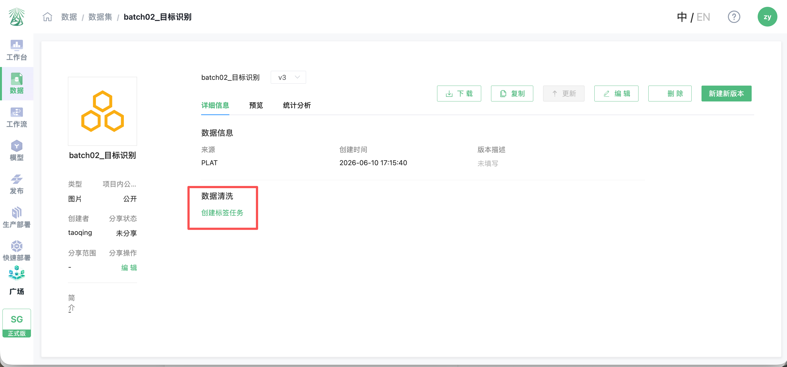

点击【创建标签任务】后，系统会打开任务设置窗口。若沿用原数据集名称，标注完成后会在原数据集基础上新增一个版本；若重新命名数据集，则会重新创建一个新的数据集用于保存标注结果。

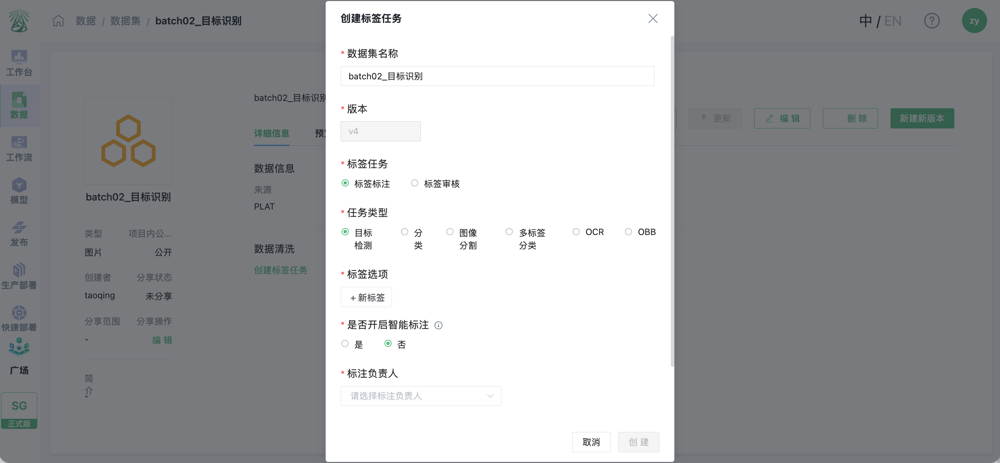

配置项说明：

| 配置项 | 说明 |
| --- | --- |
| 数据集名称 | 标注结果保存的数据集名称。沿用原名称时，结果会作为原数据集的新版本保存；修改为新名称时，结果会生成新的数据集 |
| 版本 | 系统自动生成的目标版本号，通常不可手动修改 |
| 标签任务 | 选择任务阶段，包括【标签标注】和【标签审核】；【标签标注】用于创建人工标注任务，【标签审核】用于复核、确认或修正已完成的标注结果 |
| 任务类型 | 选择标注任务类型，支持目标检测、分类、图像分割、多标签分类、OCR、OBB 等类型 |
| 标签选项 | 配置本次任务可使用的标签类别，可点击【+ 新标签】新增标签 |
| 是否开启智能标注 | 选择是否启用智能辅助标注；开启后可借助模型能力辅助生成标注结果，关闭时由标注人员手动完成 |
| 标注负责人 | 指定执行本次标注任务的人员。负责人会在待办列表中看到任务并进入 Labeling 页面处理 |
| 创建 | 配置完整后点击【创建】生成标签任务；若必填项未完成，按钮会保持不可用状态 |

以目标检测任务为例，可将标签选项配置为 `light`、`glass`、`human`，标注负责人选择 `royallazy`，截止时间设置为 `2026-07-03 00:00:00`。完成后，负责人需要在截止时间前进入 Labeling 页面完成对应图片的标注。

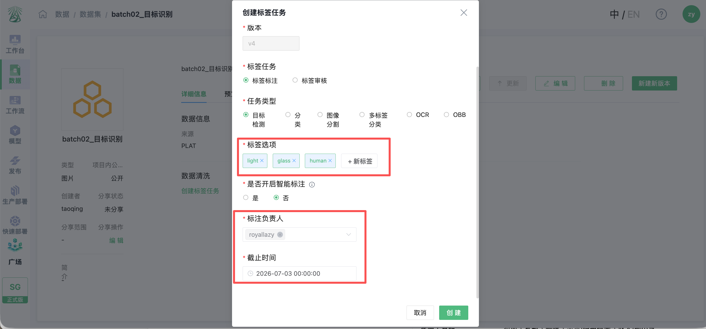

注意事项：标签名需要与后续模型训练中的类别名称保持一致。例如训练任务中使用 `light`、`glass`、`human` 作为类别名称时，标签任务中也应使用完全一致的标签名，避免因大小写、拼写或中英文不一致导致训练数据无法正确匹配类别。

操作步骤：进入项目 -> 上传待标注图片资源 -> 进入数据集详情页 -> 点击【创建标签任务】-> 配置任务名称、任务类型、标签、负责人等信息 ->【创建】-> 标注负责人在待办列表中打开任务 -> 进入 Labeling 标注页面 -> 完成标注 ->【提交任务】-> 回到资源页面查看或下载标签资源。

点击【创建】后，标签任务创建完成。回到项目工作台，在右侧【待办列表】中可以找到刚刚创建的标签任务。任务列表会展示任务名称、任务状态和任务时间，点击任务即可进入后续标注页面。

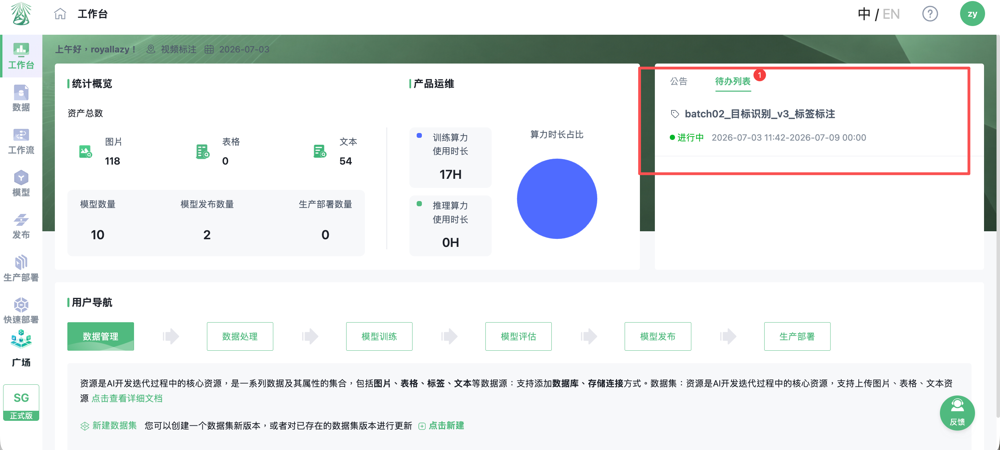

### 1.7 使用 Labeling 标注工具

Labeling 是 AI-PLAT 的在线标签标注工具，主要用于图片标注和审核。

从工作台【待办列表】点击标签任务后，即可进入 Labeling 工具开始标注。

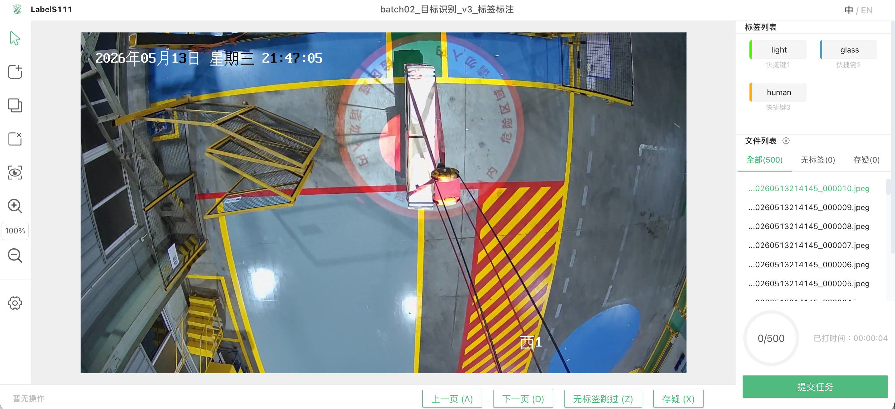

页面组成：

| 区域 | 说明 |
| --- | --- |
| 顶部标题栏 | 左侧显示 Labeling 工具名称，页面中间显示当前标签任务名称，右侧可切换中英文界面 |
| 左侧工具栏 | 提供选择、创建标注、复制标注、删除标注、显示或隐藏标注、放大、缩小、设置等常用工具 |
| 图片展示区 | 展示当前待标注图片，是绘制目标框、分割区域或其他标注结果的主要操作区域 |
| 右侧标签列表 | 展示创建任务时配置的标签，例如 `light`、`glass`、`human`；标注前先选择对应标签，再在图片上绘制标注 |
| 右侧文件列表 | 展示本次任务分配的图片，可按【全部】【无标签】【存疑】筛选，点击文件名可切换待标注图片 |
| 底部翻页按钮 | 支持切换上一页、下一页，也可对当前图片执行【无标签跳过】或【存疑】操作 |
| 任务进度区 | 显示已完成数量和总任务数量，例如 `0/500`，并展示已打时间 |
| 提交任务按钮 | 标注完成后点击【提交任务】，将本次标签结果提交至平台 |

在目标检测场景中，先在右侧【标签列表】中点击需要标注的类别，例如 `glass`；随后在图片展示区对目标位置拖拽拉框，完成一个目标检测框的绘制。若同一图片中存在多个目标，可继续选择对应类别并重复拉框。

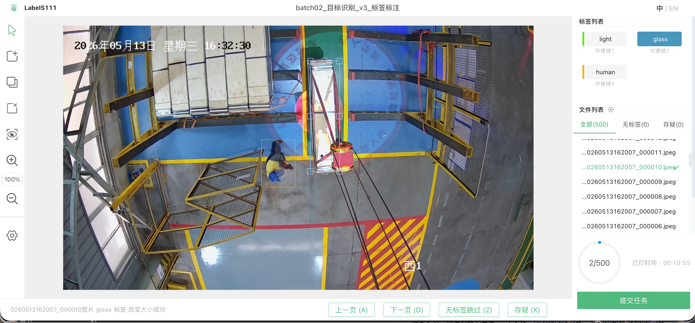

标注过程中既可以使用左侧工具栏按钮，也可以使用快捷键提升效率。例如可使用上一页、下一页、无标签跳过、存疑、添加标签、复制标签、删除标签、放大、缩小、显示或隐藏等快捷操作。

快捷键可在左侧工具栏的【设置】中进行调整。进入设置后切换到【快捷键设置】，即可根据个人使用习惯修改上一页、下一页、无标签跳过、存疑、添加标签、复制标签、删除标签、回退、放大、缩小等快捷键。

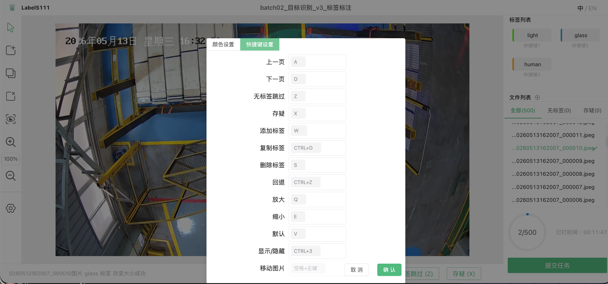

完成所有标签标注或审核后，点击右下角【提交任务】完成当前任务。提交前请确认所有需要处理的图片均已完成标注、跳过或标记存疑。

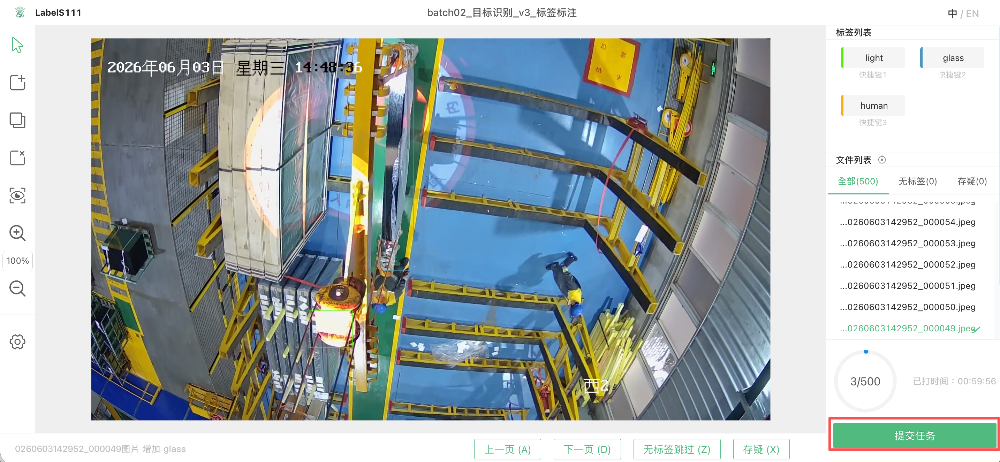

点击【提交任务】后，系统会弹出确认窗口。确认提交后，本次标签任务结束，已提交的标注结果将进入平台流程，通常不能再继续修改。

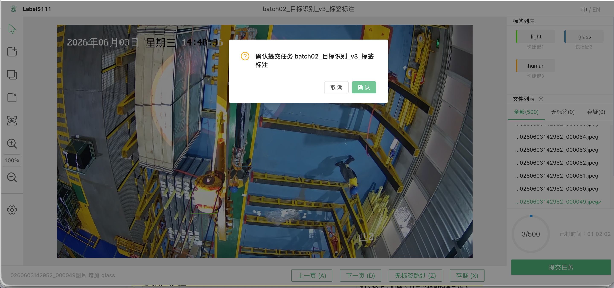

如任务中途尚未完成，可直接关闭页面。平台会临时保存当前标注进度和停留位置；再次从待办列表进入同一任务时，会自动回到上次结束的位置继续处理。

标签任务完成后，可回到【数据】->【数据集】页面查看标注结果数据集。如果创建任务时沿用了原数据集名称，结果会体现在原数据集的新版本中；如果创建任务时重新命名了数据集，则会在数据集列表中生成新的数据集。

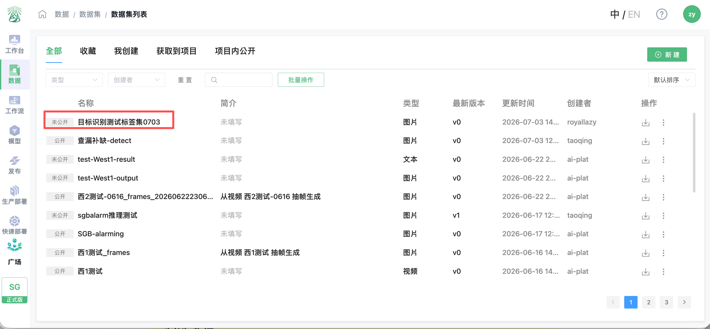

常用操作：添加标签、复制标签、删除标签、显示/隐藏标签、放大/缩小、上一页/下一页、无标签跳过、存疑。

支持页面类型：目标检测页面、图像分类页面、图像多标签分类页面、图像分割页面。

### 1.8 创建图像处理工作流

功能用途：用于对原始图片进行切图、亮度调整、对比度调整等预处理，使图片满足模型训练条件。若图片已经标注，标签文件有时也需要对应处理。

前期准备：已加入项目、已上传待处理图片、如有标签需准备与图片一一对应的标签文件、已获取图像处理组件，例如【固定区域切图】。

数据要求：图片格式为 `.jpg`、`.png`、`.bmp`；目标检测和分类标签常用 `.xml`；图像分割标签支持 `.xml` 或 `.json`。

操作步骤：上传待处理图片和标签资源 -> 从市集获取图像处理组件至项目 -> 进入项目【工作流】->【新建】-> 选择【新建工作流】或从模板库选择已有模板 -> 填写工作流名称、概述、说明 ->【完成】-> 进入工作流画布 -> 将输入资源、图像处理组件、输出资源拖拽到画布 -> 连接节点 -> 配置输入输出资源 -> 配置组件参数 ->【保存】->【运行】-> 选择运行设备 -> 查看日志 -> 查看或下载输出资源。

进入项目后，点击左侧菜单【工作流】，在工作流列表右上角点击【新建】。

进入流程选择页面后，可以选择【新建工作流】从空白画布开始搭建，也可以进入【模板库】选择已有模板创建。选择【新建工作流】后，点击【下一步】。

在填写工作流信息页面，依次填写名称、概述和说明。名称用于在工作流列表中识别该流程，概述用于简短描述工作流用途，说明可补充工作流的使用场景或处理目标。填写完成后点击【完成】。

点击【完成】后，系统会自动跳转到工作流画布页面。画布左侧会展示工作流基本信息、输入资源、输出资源和组件列表，中间区域用于搭建流程，顶部工具栏提供上一步、下一步、编辑、复制、粘贴、删除、运行、保存、另存为模板等操作。后续可在画布中添加输入资源、处理组件和输出资源，开始搭建图像处理工作流。

在画布左侧可以找到【输入资源】【输出资源】以及已获取到项目中的组件。搭建工作流时，可通过拖拽方式将所需节点放入画布：先拖入输入资源，再拖入数据处理组件，例如【图像预处理（放缩）】，最后拖入输出资源。不同组件对输入、输出资源的数量要求不同，需按照组件要求放置对应数量的输入资源和输出资源。

节点放置完成后，将上一个节点的输出端连接到下一个节点的输入端，形成完整处理链路。图像处理类工作流通常为“输入资源 -> 图像处理组件 -> 输出资源”的结构；连接完成后，再继续配置各节点的资源和组件参数。

工作流搭建完成后，需要继续配置输入资源、输出资源和组件参数。将鼠标悬浮在节点连接口的圆点上，页面会提示该接口需要的数据格式，例如 `image`，用于确认上下游节点的数据类型是否匹配。

也可以点击画布中的组件进入【组件配置】页面查看配置内容。组件配置页面上方包含【基本信息】【输入输出资源】【运行配置】【参数配置】【更多配置】等页签。

【输入输出资源】页签用于查看当前组件要求的输入资源和输出资源格式。例如图像处理组件通常要求输入资源为图片，输出资源也为图片。配置工作流时，应确保画布中连接的输入、输出资源类型与组件要求一致。

【运行配置】通常由组件在搭建时默认配置完成，一般无需调整。若组件提供【参数配置】，则可根据实际处理目标进行自主调整，例如图像缩放比例、处理方式或其他组件参数。

【更多配置】不是所有组件都会提供，一般为进阶配置项，默认情况下不会暴露或不需要调整。普通数据处理流程保持默认即可。

配置输入资源时，点击画布中的【输入资源】节点，在右侧或弹出的配置区域选择需要进行图像处理的数据集。选择完成后，点击画布空白处即可完成该节点配置。

配置输出资源时，点击画布中的【输出资源】节点。输出资源可以选择创建一个新的数据集，也可以选择为已有数据集创建一个新版本。以创建新数据集为例，选择【新数据集】后进入下一步。

在输出资源配置页面填写新数据集名称，并确认类型、版本、简介和版本说明等信息。页面内容较多时，需要向下滚动到页面底部。

确认无误后，点击底部【完成】创建输出数据集，并返回工作流画布。

工作流搭建和配置完成后，建议先点击右上角【保存】。这是一个很好的习惯，可以避免因网络波动、页面关闭或误操作导致工作流结构和配置丢失，需要重新搭建。

检查工作流节点、资源和组件参数无误后，点击右上角【运行】。根据当前项目已分配设备的资源占用情况，可以选择【立即运行】或【预约运行】。

选择【立即运行】后，需要选择已分配到当前项目中的设备资源作为运行算力，然后点击【运行】开始任务。若设备被占用，可以选择预约运行；若没有可用设备，请联系管理员添加或分配设备。

选择【预约运行】时，可以设置任务开始日期和开始时间。平台会根据所选时间安排任务运行，适合在设备繁忙时预约空闲时段执行。

任务开始后，右上方会出现【终止】按钮，可用于停止当前任务；组件节点右侧会显示实时完成进度，便于观察任务当前处理状态。

运行过程中，可点击组件节点旁的【日志】查看实时运行状态和报错信息。日志中会展示处理时间、处理进度、文件处理情况等内容，可用于排查组件是否正常运行。

任务完成后，组件节点会显示绿色对勾，表示该组件已运行完成。也可以继续点击【日志】查看完整运行记录。

工作流运行后，也可以回到【工作流】列表查看当前任务运行进度和状态。

处理完成后，可进入【数据】->【数据集】页面，找到本次工作流生成的新数据集。

注意事项：概述长度不超过 20 个字符。如项目内无设备，请联系运维人员添加设备。

### 1.9 创建模型训练工作流

功能用途：用于基于训练图片、标签和预训练模型训练新的深度学习模型。

前期准备：已加入项目、已上传训练图片、已上传训练标签、已准备预训练模型、已获取模型训练组件，例如【训练目标检测模型】。

数据要求：训练图片支持 `.jpg`、`.jpeg`、`.png`、`.bmp`。训练标签需与图片对应。目标检测标签通常为包含类别名和位置的 XML 文件。标签类型建议设置为英文字符。

操作步骤：上传训练所需资源 -> 从市集获取模型训练组件至项目 -> 进入项目【工作流】->【新建】->【新建工作流】-> 填写工作流信息 -> 进入画布 -> 拖拽训练图片、训练标签、预训练模型、训练组件和输出资源 -> 连接节点 -> 配置输入资源和输出资源 -> 配置训练组件参数 -> 如需高级调参点击【更多配置】->【保存】->【运行】-> 选择运行设备 -> 查看训练日志 -> 查看并下载输出资源。

模型训练工作流通常包含两个输入资源：一个是训练用的图片及标签数据集，另一个是基础模型。输入资源需要全部配置完整，否则工作流无法正常开始训练。

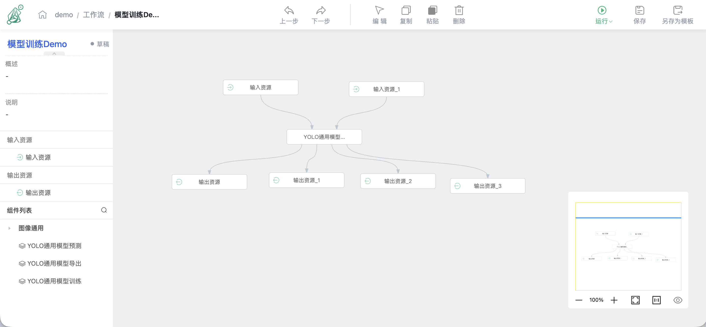

点击训练组件可进入【组件配置】。在【基本信息】页可以查看组件名称、来源、版本、注册者、运行环境和组件说明，用于确认当前使用的训练组件是否符合本次训练需求。

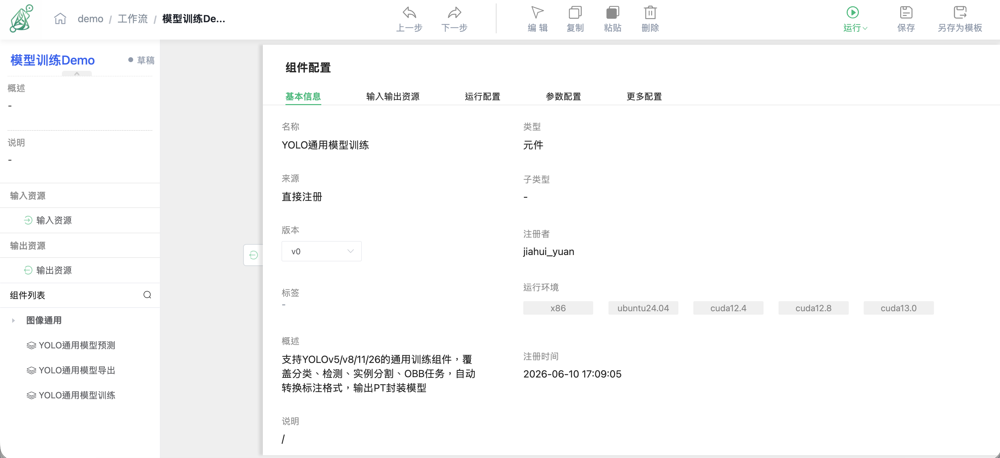

在【输入输出资源】页可以查看当前组件要求的输入、输出格式。以 YOLO 通用模型训练组件为例，输入资源 1 为图片数据集，输入资源 2 为模型；输出资源 1 为训练好的模型，输出资源 2、3、4 可用于保存运行配置、运行日志和训练报告等结果文件。

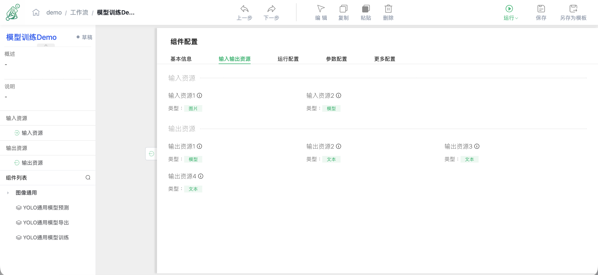

配置输入资源时，输入资源 1 选择需要参与训练的图片及标签数据集。该数据集应已完成标签上传或标注任务回写，保证图片和标签可以一一对应。

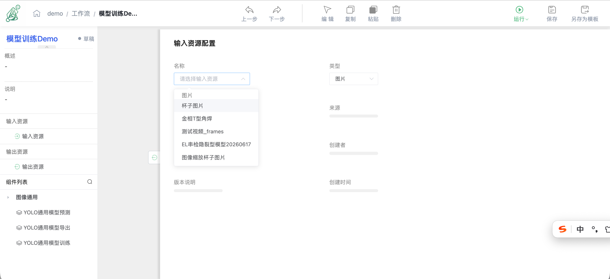

输入资源 2 选择与训练参数匹配的预训练模型。需要特别注意，预训练模型需要和组件参数中的模型框架保持一致，例如参数配置中选择 `yolo11`，则输入资源 2 也应选择 `yolo11` 对应的预训练模型，避免因框架不一致导致训练失败。

输出资源至少需要配置一个。若只需要训练后的模型，可以只配置模型输出；若需要保留训练过程信息，可继续配置运行配置、运行日志和 HTML 训练报告。HTML 报告通常包含训练基本信息、数据集分析、验证结果展示和指标趋势图等内容，便于训练完成后复盘模型效果。

配置模型输出时，可以选择创建新的模型，也可以选择为已有模型创建新的版本。选择创建新的模型版本后，填写模型名称、类型、简介或版本说明等信息，确认无误后点击【完成】完成创建。

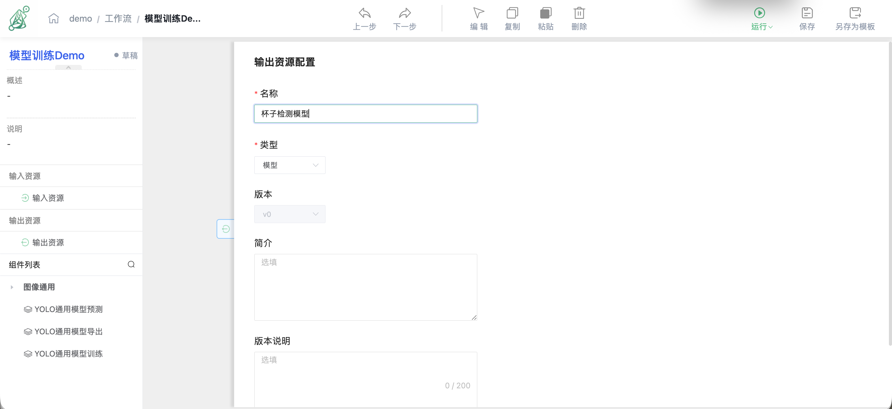

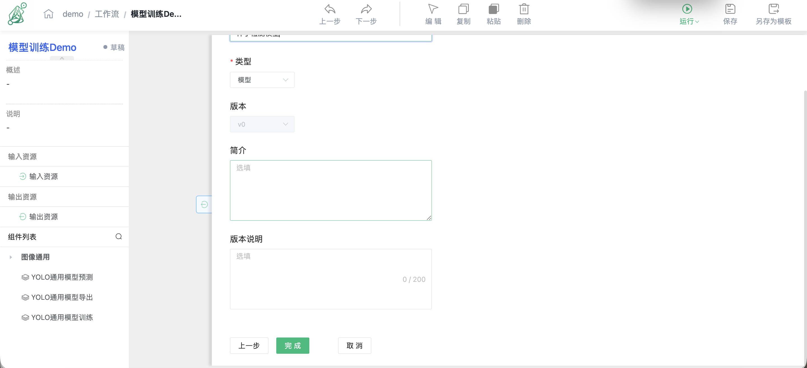

在【运行配置】页可以查看组件默认的运行资源要求。这些配置一般由组件搭建时预先设定，普通使用场景无需调整。

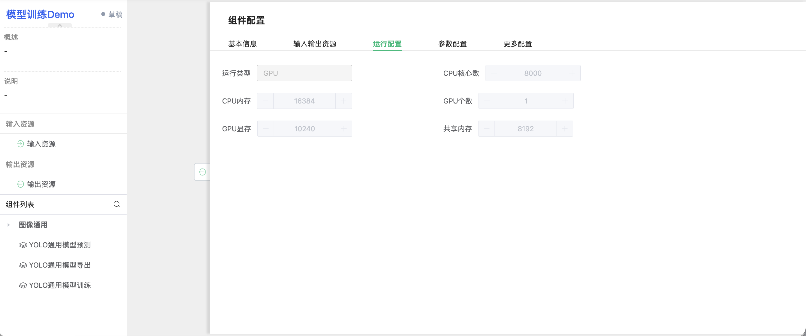

在【参数配置】页根据训练目标填写或调整参数。以【YOLO 通用模型训练】组件为例，可以选择 YOLO 模型版本，例如 `yolov5`、`yolov8`、`yolo11`、`yolo26`。这里选择的 YOLO 版本需要和输入资源 2 中选择的预训练模型版本保持一致。

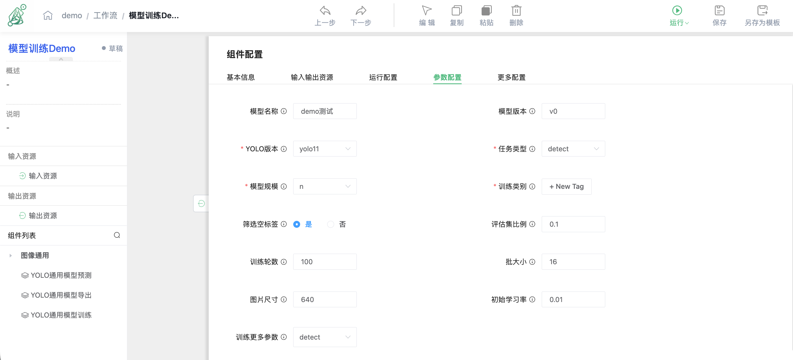

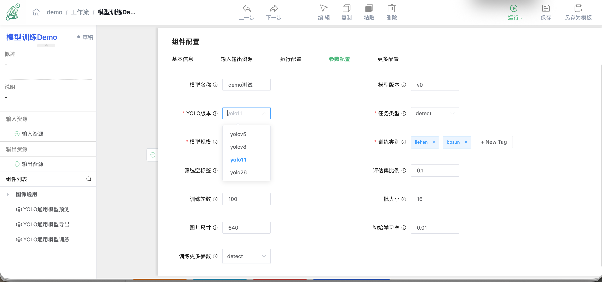

任务类型用于确定模型训练方向，可选择 `classify`、`detect`、`segment`、`obb`，分别对应图像分类、目标检测、图像分割和旋转框检测。选择时需要与训练集标签类型保持一致。

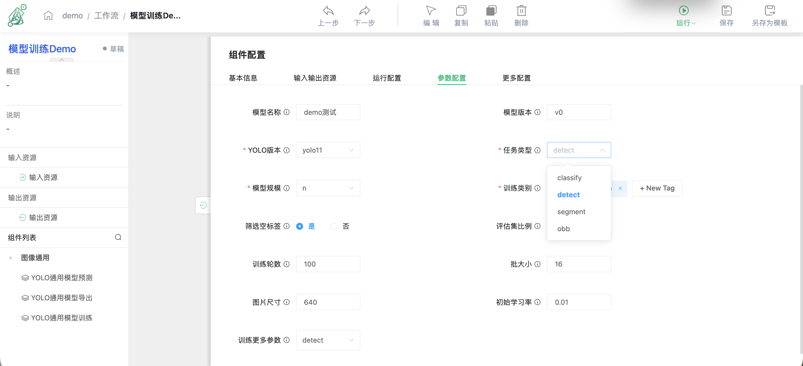

模型规模用于选择训练模型的大小，常见选项包括 `n`、`s`、`m`、`l`。一般来说，规模越大模型能力越强，但训练耗时和资源占用也会更高；规模越小训练更快，更适合快速验证。

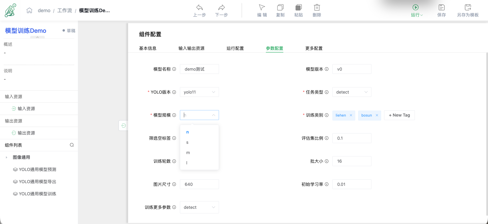

训练类别用于填写本次需要训练的标签名称。标签类别名称必须与训练集中的标签名称完全一致，包括大小写、空格、下划线等细节，否则平台可能无法正确匹配标签，影响训练结果。

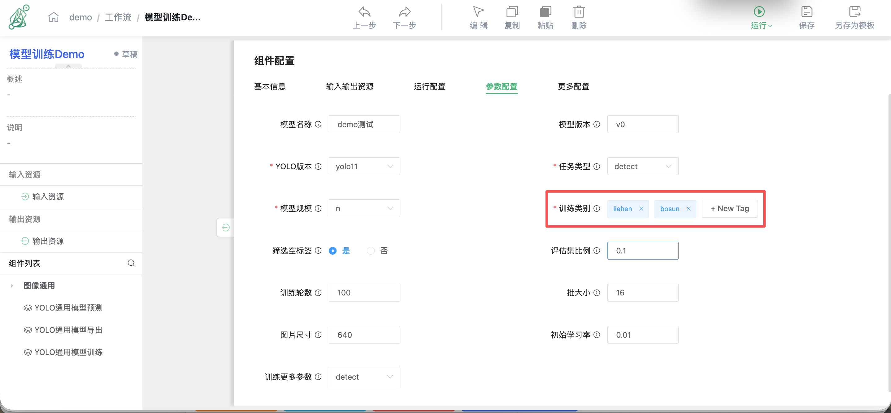

其他常见参数包括是否筛选空标签、评估集比例、训练轮数、批大小、图片尺寸、初始学习率和训练更多参数。若没有特别调参需求，可以先使用默认值完成训练验证。

【更多配置】用于查看或调整更细粒度的训练参数。并非所有组件都会开放进阶配置，一般情况下保持默认即可，只有在明确需要调参时再修改。

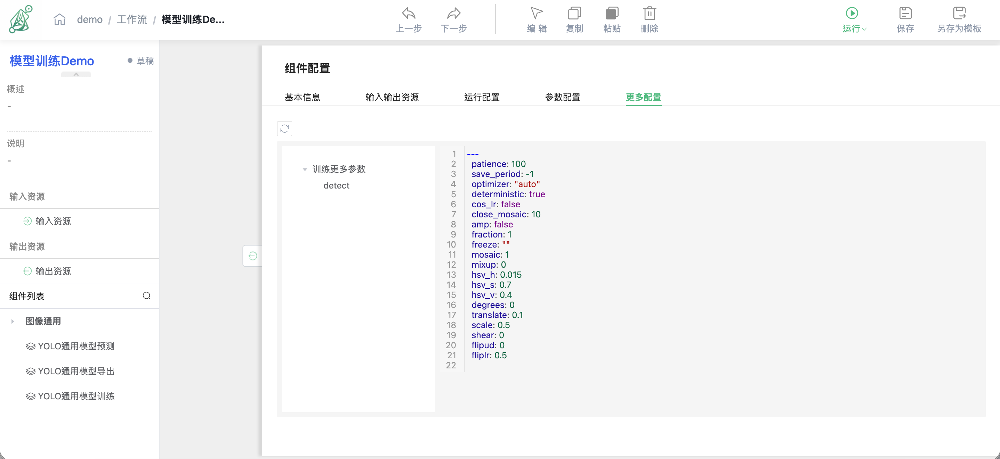

配置检查无误后，点击右上角【运行】，选择可用算力后点击【运行】开始模型训练。如果当前没有可用算力，可以更换算力资源、预约运行，或联系管理员确认资源分配情况。

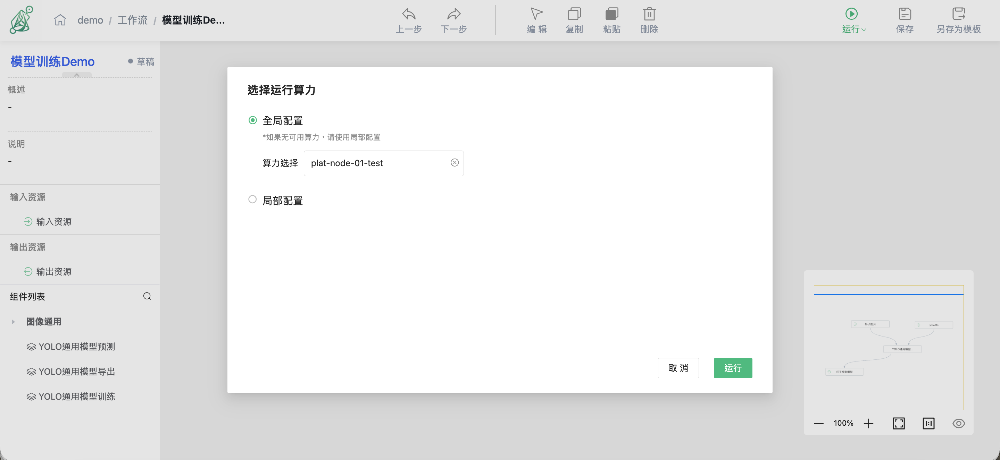

日志查看方式：工作流日志可在工作流右上角【日志】查看所有元件日志；元件日志可点击具体元件后进入【日志】查看。

工作流运行完成后，进入项目左侧菜单【模型】->【模型】，可以在模型列表中找到训练完成后生成的模型。模型列表会展示名称、简介、发布数量、来源、最新版本、更新时间、创建者和操作等信息，便于确认模型来源与版本。后续可基于该模型继续发布、预测或创建新的模型版本。

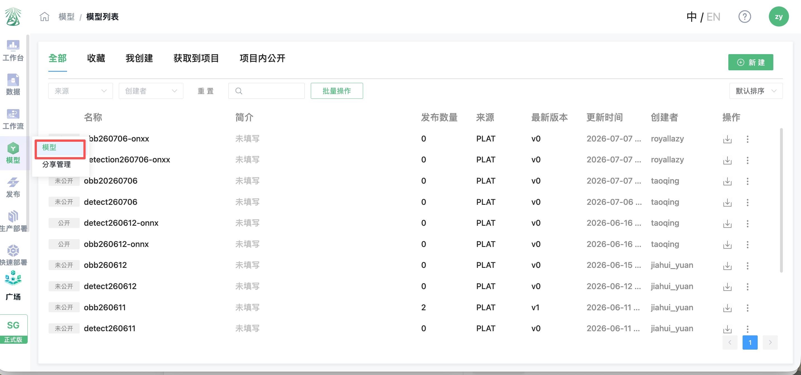

### 1.10 创建模型预测工作流

功能用途：用于对训练好的模型进行批量预测，帮助客户观察模型在测试数据上的实际效果。

注意事项：AI-PLAT 暂不支持对本地上传的模型进行预测操作，仅支持对 AI-PLAT 生产出的模型进行预测操作。

前期准备：已上传测试图片、已有 AI-PLAT 生产出的模型、已获取模型预测组件，例如【目标检测模型预测】。

操作步骤：上传测试图片资源 -> 确认已有可用于预测的模型资源 -> 从市集获取模型预测组件 -> 新建工作流 -> 在画布中连接测试图片、模型、预测组件和输出资源 -> 配置输入输出资源 -> 配置预测组件参数 ->【保存】->【运行】-> 选择运行设备 -> 查看日志 -> 查看或下载预测输出资源。

模型预测工作流通常包含两个输入资源和三个输出资源。输入资源 1 选择需要预测的图片或测试集，输入资源 2 选择需要用于预测的模型。输出资源 1 为模型检测后的画框图，输出资源 2 为模型反打后的图片和对应标签，输出资源 3 为 HTML 报告；报告中包含推理统计信息，如果输入测试集本身带有标签，还会额外展示评估指标。

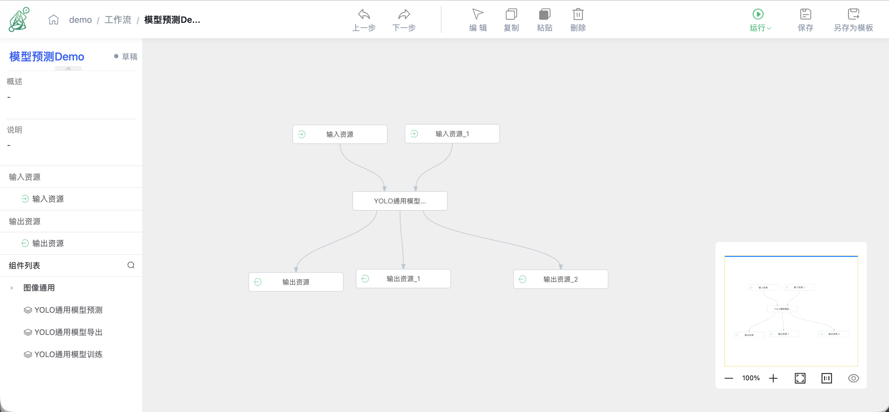

点击预测组件可进入【组件配置】。在【基本信息】页可以查看组件名称、来源、版本、注册者、运行环境和组件说明，用于确认当前使用的是 YOLO 通用模型预测组件。

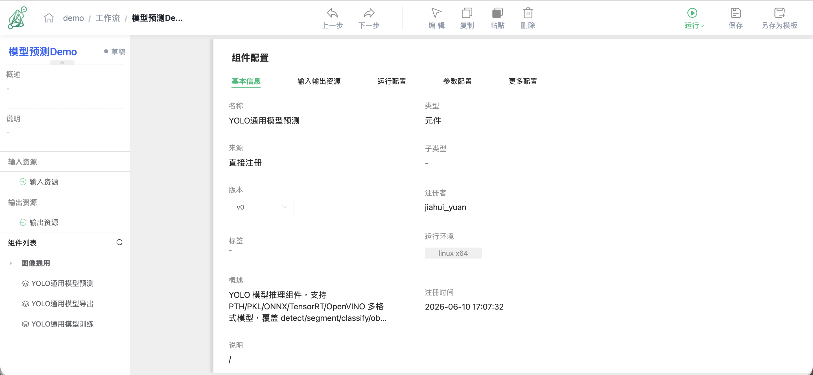

在【输入输出资源】页可以查看组件要求的数据格式。以 YOLO 通用模型预测组件为例，输入资源 1 为图片，输入资源 2 为模型；输出资源 1 和输出资源 2 为图片，输出资源 3 为文本类报告资源。

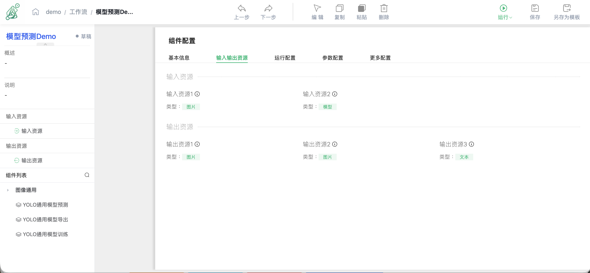

配置输入资源时，输入资源 1 选择需要预测的图片数据集或测试集。

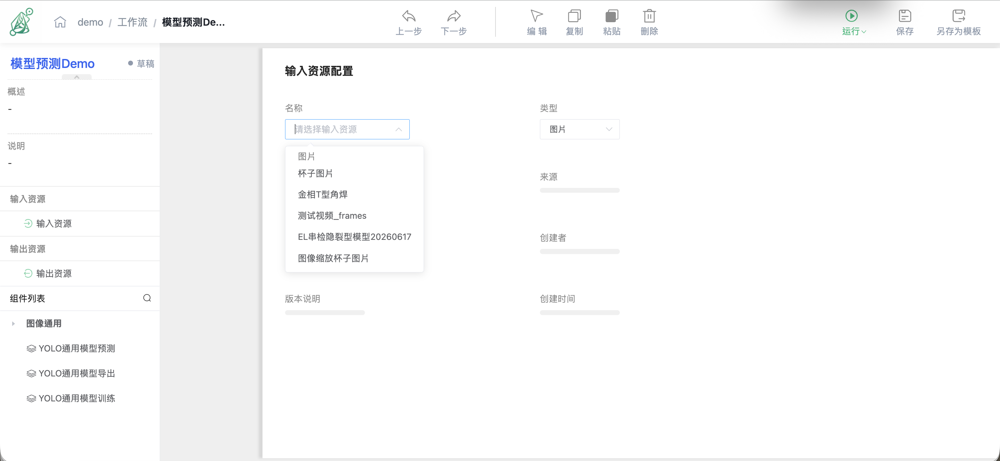

输入资源 2 选择用于执行预测的模型，通常选择前面模型训练工作流产出的模型，或项目中已有的可用模型。

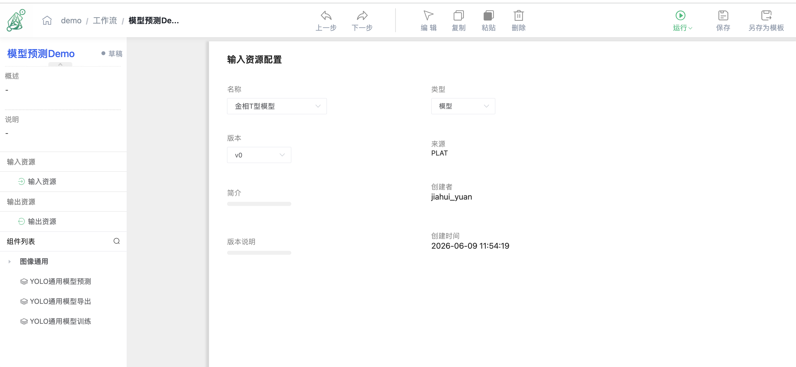

输出资源可选择新建数据集，也可以选择为已有数据集创建新的版本，操作方式与前面工作流输出资源配置一致。配置完成后回到画布继续检查组件参数和连线。

在【运行配置】页可以查看组件默认的运行资源要求。该部分通常由组件预先配置，普通预测任务无需调整。

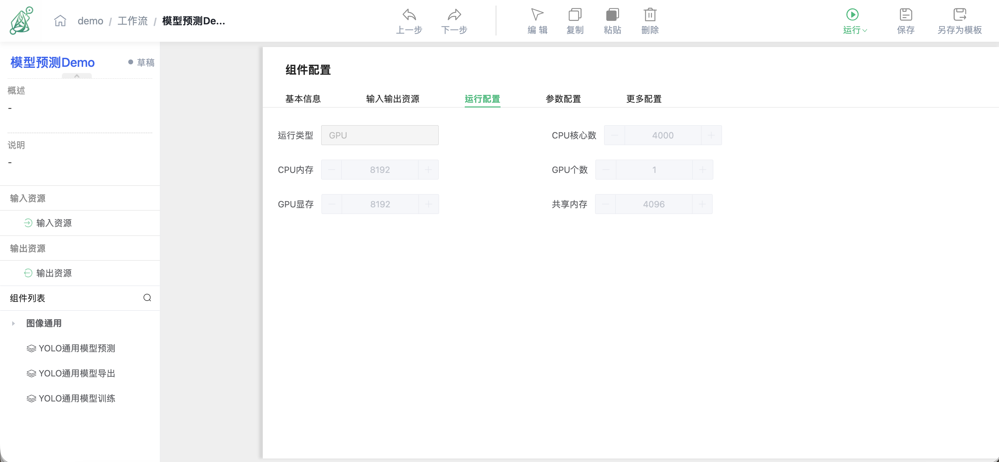

在【参数配置】页按预测场景调整参数。常见参数包括置信度阈值、IOU 阈值、推理图片尺寸、任务类型、是否启用 FP16 推理、最大检测数和标签列表。置信度阈值会影响检测结果的保留严格程度，IOU 阈值会影响重叠框的过滤效果；如果只希望输出指定类别的预测结果，可以在标签列表中填写需要保留的类别。

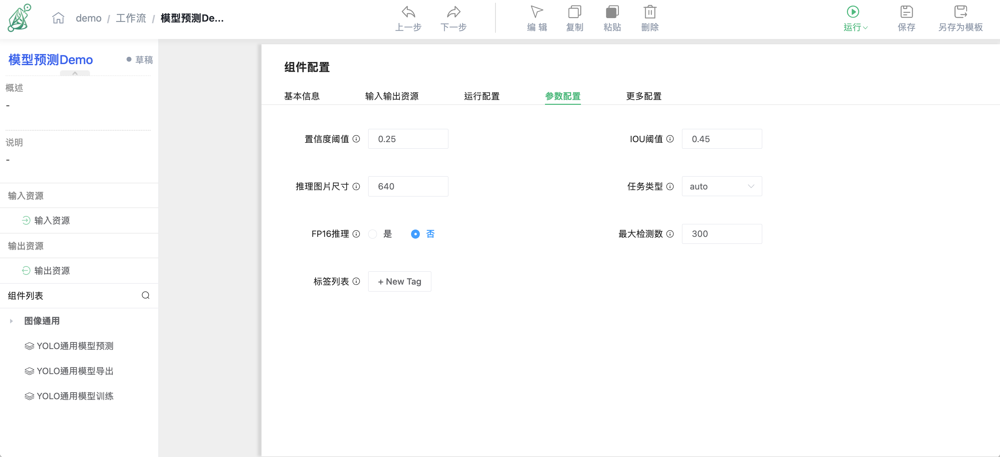

预测工作流完成后，进入【数据】->【数据集】，打开预测输出的数据集，在【预览】页可以查看模型预测后的结果。画框图会展示模型识别到的目标位置、类别和置信度，便于快速判断预测效果。

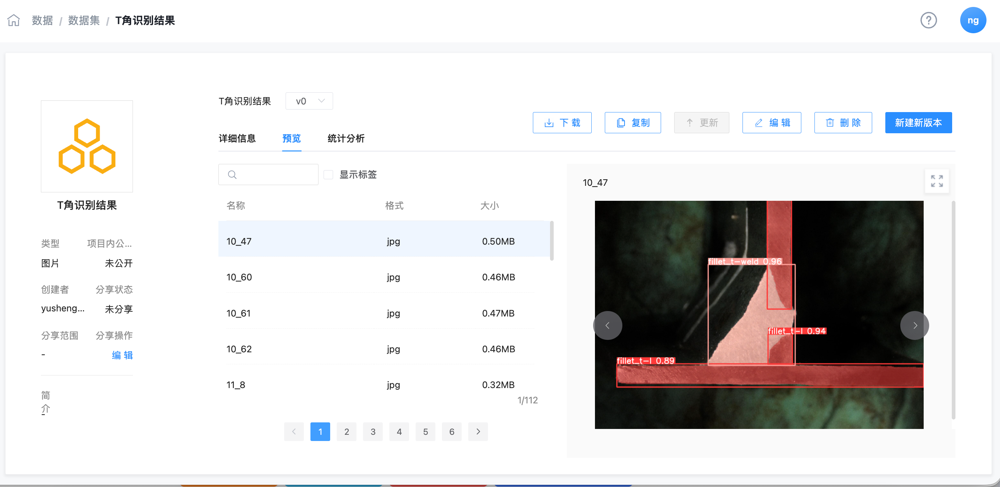

### 1.11 运行配置与设备选择

| 运行方式 | 说明 |
| --- | --- |
| 立即运行 | 工作流配置完成后立即运行，较短时间内输出结果 |
| 预约运行 | 预约 7 天内的可用时间段运行，便于利用空余算力 |

立即运行：工作流绘制完成并配置参数后，点击【运行】->【立即运行】-> 选择运行设备 -> 开始运行。

预约运行：工作流绘制完成并配置参数后，点击【运行】->【预约运行】-> 选择 7 天内日期和开始时间 -> 点击【预约】。预约成功后，页面会显示任务开始时间和预计运行时间。

设备选择说明：全局配置为整个工作流选择运行设备；局部配置为工作流内单个组件选择运行设备。如项目内无可用设备，请联系运维人员添加或分配设备。

### 1.12 发布模型

功能用途：用于将训练或测试通过的模型发布到平台发布管理中。模型发布后会形成可管理的发布记录，后续可用于快速部署、生产部署或对外服务验证。

适用角色：AI 生产工程师通常负责提交模型发布；项目管理员或具备审批权限的管理员负责确认发布信息、审批发布记录，并管理模型上架、下架或取消发布等操作。

操作入口：项目内【模型】->【模型】-> 点击需要发布的模型。

操作步骤：

1. 进入项目左侧【模型】页面，在模型列表中找到需要发布的模型。发布前建议重点核对模型名称、来源、最新版本、更新时间、创建者和发布数量，确认当前选择的是计划对外验证或部署的模型版本。确认无误后，点击模型名称进入详情页。

2. 在模型详情页查看当前模型版本、模型框架、标签列表和发布状态。确认模型信息无误后，在【发布信息】区域点击【发布】。

3. 在发布弹窗中填写发布信息，包括简介、适用场景、适用范围等。标签列表、推理框架和模型框架会根据当前模型信息展示，通常无需手动修改。填写完成后再次核对模型版本、标签类别、推理框架和适用范围，确认无误后点击【发布】提交。

4. 提交发布后，平台会根据当前账号权限和项目发布规则处理发布记录。具备管理员权限的账号通常可直接完成发布；普通成员提交后，可能需要管理员审批。审批通过后，模型详情页的发布状态会变为【已发布】。如后续不再使用该发布模型，可在同一区域点击【取消发布】。

5. 点击左侧【发布】进入发布列表，可查看刚刚发布的模型。列表中会展示名称、简介、状态、适用场景、适用范围、版本、发布时间和操作入口。

6. 发布记录可作为后续快速部署、API 部署或生产部署的模型来源。若发布记录未审批通过、未上架或已取消发布，后续部署页面可能无法选择该模型，需先完成发布管理中的状态确认。

配置说明：

| 配置项 | 说明 |
| --- | --- |
| 简介 | 用于补充说明模型能力、适用对象或使用注意事项，可按实际情况填写 |
| 适用场景 | 描述模型主要解决的业务场景，如金相识别、缺陷检测、目标识别等 |
| 适用范围 | 描述模型适用的项目、产线、客户或业务范围，便于后续检索和管理 |
| 标签列表 | 展示当前模型支持识别的类别。发布前应确认标签名称与模型训练时使用的类别一致 |
| 推理框架 / 模型框架 | 根据当前模型信息自动展示，一般无需修改 |
| 发布状态 | 未发布时可点击【发布】；提交后可根据权限进入待审批或已发布状态；已发布后可在详情页点击【取消发布】 |

注意事项：

- 发布前应确认模型版本、标签类别、适用场景和适用范围填写准确，避免后续部署时选择错误模型。
- 普通成员提交发布后，如页面提示需要审批，请联系项目管理员或发布管理员处理。
- 已发布模型会出现在【发布】模块中，后续快速部署、生产部署或模型服务验证时可从发布列表中选择。
- 取消发布或下架会影响后续部署选择。对已在使用中的模型执行此类操作前，应先确认是否存在关联的 Demo、API 服务或生产部署任务。

### 1.13 快速部署模型

功能用途：快速部署用于对已发布并上架的模型进行在线验证和临时展示，帮助研发、算法或业务人员以简化流程检查当前模型的检测能力。快速 Demo 的使用方式与模型预测工作流相近，适用于快速查看模型对测试图片的识别效果，不作为长期在线服务。

使用场景：通过快速 Demo 完成在线效果验证或现场演示；通过 API 部署获取临时调用凭证，进行本地调试和模型服务调用验证。

操作入口：项目内左侧【快速部署】。页面提供【快速 Demo】和【API 部署】两个页签，可按验证方式查看部署记录，并使用【新建】创建部署。

部署方式说明：

| 部署方式 | 用途 | 适用场景 |
| --- | --- | --- |
| 快速 Demo | 为模型创建可在线访问的临时演示页面 | 在线测试模型效果、向业务人员展示检测能力 |
| API 部署 | 为模型创建临时调用凭证 | 本地调试、接口联调和程序化调用验证 |

注意事项：快速 Demo 为临时部署，限制时长最长为 2 小时。到达限制时长后，平台将停止该部署；如不再需要，应及时手动终止以释放算力资源。Web 页面形式的快速 Demo 目前仅支持目标检测模型；API 调试支持目标检测、分类、分割三种应用场景。

#### 新建快速 Demo

操作入口：项目内【快速部署】->【新建】->【快速Demo】。

操作步骤：

1. 进入项目左侧【快速部署】，在【快速 Demo】页签点击【新建】。在部署方式选择页面点击【快速 Demo】。
2. 在【选择待部署模型】步骤中，选择已发布并上架的模型及对应版本。模型下拉列表仅展示当前账号有权限使用的发布模型；如未找到目标模型，请先在【发布】中确认模型已完成发布和上架。

3. 在【填写部署信息】步骤中填写部署名称，选择限制时长，并选择可用于快速部署的训练算力资源。限制时长应满足现场验证或演示需要，最长不得超过 2 小时。

4. 在【配置部署参数】步骤中，为模型输出标签配置置信度阈值。阈值表示目标检测结果需要达到的最低置信度：只有置信度高于所设阈值的目标才会在 Demo 中展示。阈值越高，展示结果通常越严格；阈值越低，可能展示更多候选目标。应结合模型测试结果和现场展示要求设置。

5. 确认配置后点击【完成】。平台将创建并启动临时部署，随后自动进入部署详情页。若算力资源正在排队或启动中，可在详情页查看当前状态、剩余时长和运行信息；启动完成后，可使用页面提供的 Demo 访问地址进行在线验证或演示。

6. 完成验证或演示后，在部署详情页点击【终止】。终止后，该快速 Demo 不再运行；如需再次使用，应重新创建部署或按平台页面指引重新启动。

快速 Demo 页面通常包含图片上传、图片展示和模型识别结果等区域，可用于直观检查当前模型的检测效果。实际可上传文件数量、支持格式和结果展示形式以平台页面提示为准。

使用建议：

- 快速 Demo 仅应选择已完成效果检查、适合对外展示的模型版本。
- 选择算力资源前，应确认资源处于可用状态并满足当前模型的运行要求。
- 调整阈值后，应使用具有代表性的测试图片复核漏检和误检情况，避免仅依据单张图片判断模型效果。
- 快速 Demo 仅用于临时验证和演示。需要长期稳定运行、持续对外提供服务时，应使用生产部署能力。

#### 新建 API 部署

操作入口：项目内【快速部署】->【新建】->【API部署】。

操作步骤：进入项目【快速部署】->【新建】->【API部署】-> 选择模型发布名称 -> 填写部署名称，平台自动生成 Token -> 选择限制时长和设备 -> 配置模型类别和置信度阈值 ->【完成】-> 启动成功后复制 Token，用于本地调试。

API 部署详情页通常包含部署信息、Token、启动时间、终止时间、剩余时长、接口用例、参数信息、运行历史和模型信息。

### 1.14 生产部署

功能用途：生产部署用于将已编写完成、可用于生产环境的推理服务部署到平台并长期运行。部署启动成功后，平台会为服务生成访问地址，业务系统或调用方可通过该 API 接口调用模型检测服务。

适用角色：AI 生产工程师负责准备推理服务、部署方案和模型版本；运维人员负责核对算力资源、服务状态和运行日志；项目管理员负责部署权限、变更审批及生产使用管理。

使用场景：已完成模型效果验证并具备生产推理服务的项目，需要持续对外提供检测能力；或需要在平台内统一管理服务访问地址、运行状态、版本更新与运维记录。

操作入口：项目内左侧【生产部署】。页面包含【部署列表】、【部署仓库】和【算力监控】三个页签；在【部署列表】中可按状态、创建者或名称筛选部署，并查看部署名称、状态、当前版本、更新时间、访问地址和操作记录。

部署前准备：

- 已确认推理服务适用于生产环境，并完成必要的功能、性能和安全性验证。
- 已准备可用的部署方案或已将部署方案加入项目部署仓库。
- 已确认待使用的模型版本、模型文件、运行参数和算力资源。
- 已明确接口调用方、访问权限及服务变更的通知范围。

#### 获取产品至项目

操作入口：市集【公共产品库】-> 产品 ->【获取】。

操作步骤：进入市集 -> 打开【公共产品库】-> 找到目标产品 -> 点击【获取】-> 在弹窗中选择目标项目 -> 点击【确认】。

注意事项：AI-PLAT 项目仅支持关联单个产品，产品关联后通常不支持修改。

#### 新建生产部署

操作入口：项目内【生产部署】-> 部署仓库 ->【新建部署】，或项目内【生产部署】->【新建】。

操作步骤：

1. 进入项目左侧【生产部署】，在【部署列表】或【部署仓库】中点击【新建】。
2. 在【选择部署方式】步骤中选择【新建部署】。如需对已有生产服务进行版本或配置变更，可选择【更新部署】；更新前应评估对现有接口调用方的影响。

3. 在【填写部署信息】步骤中填写部署名称，并选择目标部署方案及服务。部署名称应能识别业务用途、服务对象或环境，便于后续检索、告警和变更管理。
4. 在【填写服务配置】步骤中，按部署方案要求选择模型版本、配置服务运行参数，并选择算力资源或实例配置。应确保模型框架、服务依赖、算力规格和资源配额满足推理服务的运行要求。
5. 核对部署信息和服务配置后点击【完成】。平台创建部署并启动服务；启动过程中可在部署列表或详情页查看状态。服务进入可用状态后，记录页面生成的访问地址，并按接口说明完成调用验证。

部署方式说明：

| 部署方式 | 说明 |
| --- | --- |
| 智能部署 | 无需指定到具体设备显卡，只需填写部署实例数 |
| 指定部署 | 需要选择具体设备和显卡，并配置实例数 |

接口调用说明：生产部署成功后，应从部署详情页获取服务访问地址，并结合部署方案提供的接口说明配置请求地址、鉴权信息、请求参数和返回结果解析。接口地址及鉴权凭证属于生产访问资产，应仅提供给经授权的系统和人员使用；不得将访问地址、Token 或密钥写入公开文档、代码仓库或截图。

首次调用验证建议：使用具有代表性的测试数据调用接口，确认服务可访问、请求和返回格式符合预期、模型结果正确，并记录验证时间、模型版本和调用结果。完成验证后，再将接口接入业务系统。

#### 生产部署管理

| 操作 | 说明 |
| --- | --- |
| 更新 | 修改模型、实例数、设备、参数等 |
| 回退 | 更新后异常或精度偏差较大时，恢复至历史版本 |
| 启动 | 对已终止或异常状态部署进行启动 |
| 终止 | 停止运行中的部署 |
| 删除 | 删除终止或异常状态的部署 |
| 操作记录 | 查看启动、终止、更新、回退等操作历史 |
| 日志监控 | 以服务或实例维度查看日志并下载 |
| 设备监控 | 查看实例运行状态和生产设备状态 |

注意事项：

- 生产部署面向长期运行场景，不能以快速 Demo 的临时运行规则替代生产服务的资源规划和运维管理。
- 更新模型、服务参数、实例数或部署设备前，应评估接口兼容性、业务影响和回退方案；重要变更宜在业务低峰期执行。
- 部署异常时，应先查看服务状态、操作记录和日志，再根据故障原因执行启动、更新或回退操作。
- 终止或删除部署前，应确认不存在仍在调用该访问地址的业务系统，并提前通知相关使用方。

---

## 下一步阅读

完成本册后，客户应已掌握 AI-PLAT 从项目准备到模型部署的主要操作链路。下一册《AI-PLAT用户手册（三）：场景教程与支持附录》将把这些操作串联成典型使用场景，并补充常见问题、使用检查清单、支持方式和后续扩展内容。
